# Event Sourcing Architectural Patterns

## Introduction

Event Sourcing represents a fundamental shift in how we architect systems for persistence and state management. This document explores the key architectural patterns, design principles, and system components that enable robust, scalable event-sourced applications. Targeted at system architects and senior developers, it provides deep insights into architectural decisions, trade-offs, and integration strategies.

> **Foundation**: If you're new to Event Sourcing, start with [Event Sourcing Fundamentals](01-event-sourcing-fundamentals.md) to understand core concepts before diving into these architectural patterns.
> 
> **Implementation**: For concrete code examples of these patterns, see [Implementation Examples](03-implementation-examples.md).

## Core Architectural Components

### Event Store Architecture

The Event Store serves as the central nervous system of an event-sourced application, designed as an **append-only, immutable log** that captures all state changes as discrete events.

> **Fundamentals**: Review the [Core Components](01-event-sourcing-fundamentals.md#core-components) section for basic Event Store concepts.
> 
> **Implementation**: See [Event Store Implementations](03-implementation-examples.md#event-store-implementations) for technology-specific examples.

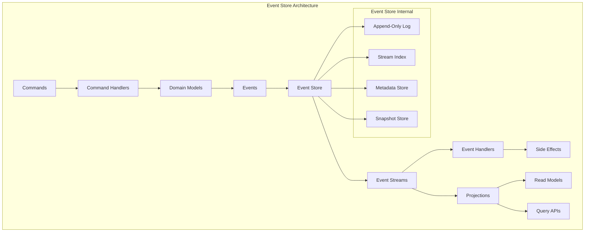

#### Key Design Principles

**Immutability**: Events are never modified after being written, ensuring data integrity and enabling reliable replay capabilities.

**Append-Only Writes**: New events are always appended to streams, never inserted or updated, optimizing for write performance and simplifying concurrency control.

**Stream Partitioning**: Events are organized into streams (typically by aggregate ID), enabling efficient retrieval and parallel processing.

**Ordering Guarantees**: Events within a stream maintain strict ordering, while global ordering may be eventually consistent across streams.

### Command and Query Responsibility Segregation (CQRS)

CQRS naturally complements Event Sourcing by separating write operations (commands) from read operations (queries), enabling independent optimization of each concern.

> **Pattern Relationship**: Learn about [CQRS integration](01-event-sourcing-fundamentals.md#relationship-to-other-patterns) in the fundamentals.
> 
> **Implementation**: See [CQRS Implementation Patterns](03-implementation-examples.md#cqrs-implementation-patterns) for practical examples.

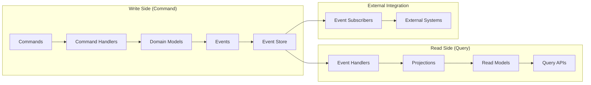

#### Architectural Benefits

**Independent Scaling**: Write and read sides can be scaled independently based on workload characteristics.

**Optimized Data Models**: Read models can be denormalized and optimized for specific query patterns.

**Technology Diversity**: Different technologies can be used for write and read sides (e.g., event store for writes, document database for reads).

**Eventual Consistency**: Accepts eventual consistency between writes and reads in exchange for better performance and availability.

### Projection Patterns

Projections transform raw event data into optimized read models, serving as the bridge between the append-only event log and query-optimized data structures.

> **Fundamentals**: Review [Projections basics](01-event-sourcing-fundamentals.md#core-components) for foundational concepts.
> 
> **Implementation**: Explore [Projection Implementation Patterns](03-implementation-examples.md#projection-patterns-and-implementations) for code examples.

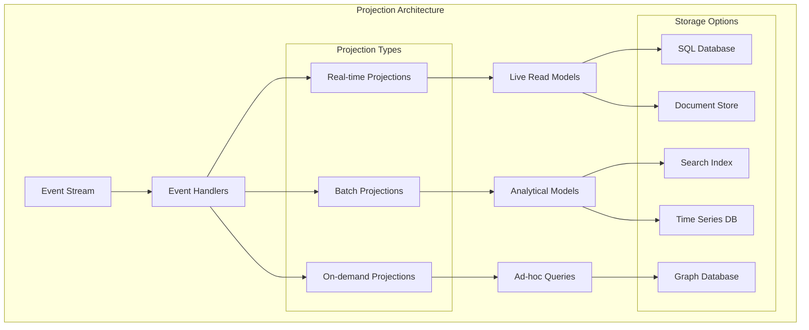

#### Projection Strategies

**Stateless Projections**: Process events independently without maintaining internal state, suitable for simple transformations.

**Stateful Projections**: Maintain internal state across events, enabling complex aggregations and computations.

**Rebuilding Capability**: All projections can be rebuilt from scratch by replaying events, providing schema evolution and error recovery.

**Multiple Projections**: Different projections can coexist for the same event stream, each optimized for specific use cases.

## Event-Driven Architecture Principles

> **Use Cases**: See how these principles apply in practice in [Event-Driven Integration Scenarios](04-use-cases-scenarios.md#event-driven-integration-scenarios).

### Event Flow and Processing Patterns

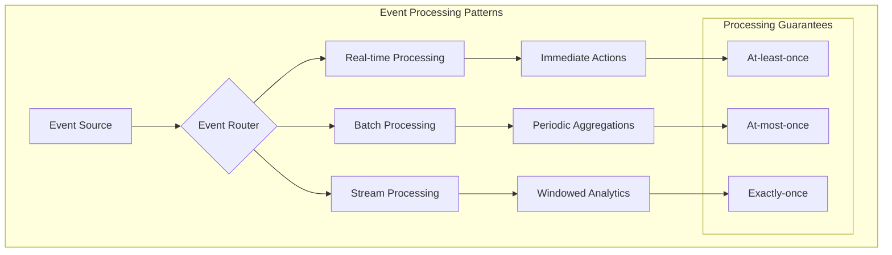

#### Event Processing Guarantees

**At-least-once Processing**: Events may be processed multiple times, requiring idempotent handlers.

**At-most-once Processing**: Events are processed at most once, potentially losing events during failures.

**Exactly-once Processing**: Events are processed exactly once, achieved through sophisticated coordination mechanisms.

### Bounded Context Integration

Event Sourcing enables clean integration between bounded contexts through well-defined event contracts.

> **Domain-Driven Design**: This builds on DDD concepts mentioned in [Relationship to Other Patterns](01-event-sourcing-fundamentals.md#relationship-to-other-patterns).
> 
> **Real-World Examples**: See [Microservices Integration Examples](04-use-cases-scenarios.md#microservices-and-distributed-systems) for practical applications.

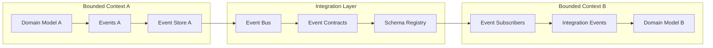

## Append-Only Log Patterns

> **Theoretical Background**: Learn about the historical origins in [Origins and Theoretical Foundations](05-origins-theoretical-foundations.md#distributed-systems-theory-and-log-based-architectures).

### Log Structure and Organization

The append-only log serves as the foundational pattern, inspired by distributed systems, databases, and blockchain technologies.

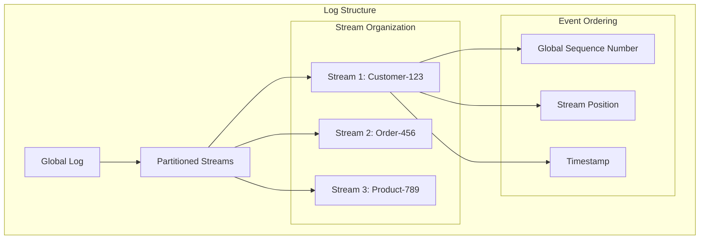

#### Log Implementation Patterns

**Single Global Log**: All events across the system are stored in a single, globally-ordered log (similar to Kafka's topic approach).

**Partitioned Streams**: Events are partitioned into separate streams based on aggregate identity, enabling parallel processing.

**Hierarchical Streams**: Streams can be organized hierarchically to support different levels of granularity.

### Immutability and Persistence Patterns

Drawing from functional programming principles, event sourcing systems implement immutable data structures with persistent characteristics.

> **Theoretical Foundations**: Explore the [Functional Programming Influences](05-origins-theoretical-foundations.md#functional-programming-influences) that shaped these patterns.

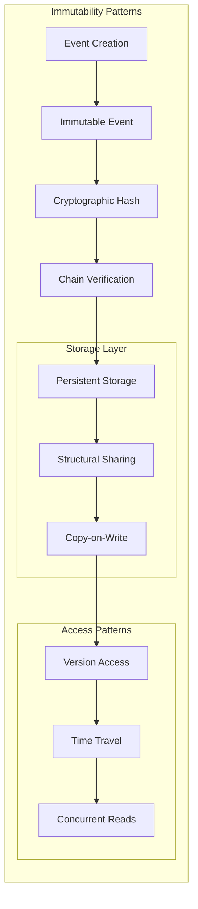

## Stream Processing Architectures

> **Real-World Applications**: See stream processing in action in [Analytics and Reporting Use Cases](04-use-cases-scenarios.md#analytics-and-business-intelligence).

### Real-Time Stream Processing

Event sourcing naturally supports stream processing patterns, enabling real-time analytics and event correlation.

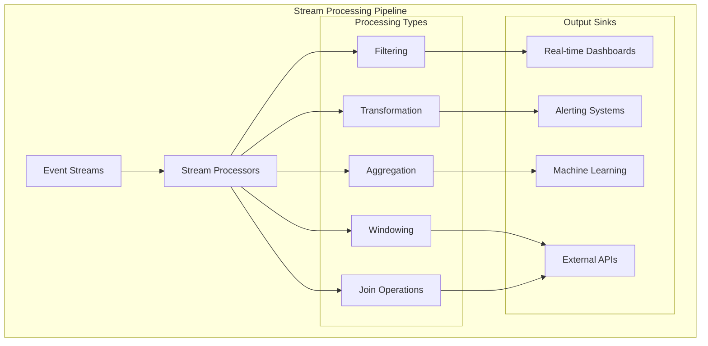

#### Stream Processing Patterns

**Event Filtering**: Select relevant events based on criteria, reducing downstream processing load.

**Event Transformation**: Convert events into different formats or extract specific information.

**Event Aggregation**: Combine multiple events to produce summary statistics or derived metrics.

**Temporal Windowing**: Process events within specific time windows for time-based analytics.

**Event Correlation**: Join events from multiple streams to detect patterns or complete business processes.

### Backpressure and Flow Control

Managing high-throughput event streams requires sophisticated flow control mechanisms.

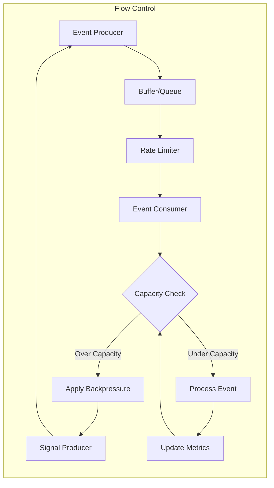

## Architectural Trade-offs and Decisions

> **Decision Framework**: For guidance on choosing between these options, see [When to Use Event Sourcing](04-use-cases-scenarios.md#decision-framework-when-to-choose-event-sourcing).

### Consistency Models

| Consistency Model | Description | Trade-offs | Use Cases |
|------------------|-------------|------------|-----------|
| **Strong Consistency** | All reads receive the most recent write | Higher latency, reduced availability | Financial transactions, critical business operations |
| **Eventual Consistency** | System will become consistent over time | Lower latency, higher availability | Social media feeds, content management |
| **Causal Consistency** | Causally related events are seen in order | Balanced complexity and performance | Collaborative applications, distributed workflows |
| **Session Consistency** | Consistency within a user session | Good user experience, manageable complexity | User-centric applications, personalization |

### Storage and Performance Considerations

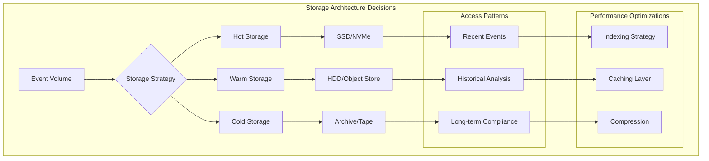

#### Performance Optimization Strategies

**Event Batching**: Group multiple events into batches to reduce I/O overhead and improve throughput.

**Compression**: Apply compression algorithms to reduce storage requirements and network bandwidth.

**Indexing**: Create efficient indexes on commonly queried fields (timestamp, event type, aggregate ID).

**Caching**: Implement multi-level caches for frequently accessed projections and snapshots.

**Sharding**: Distribute events across multiple storage nodes based on partition keys.

### Scalability Patterns

| Pattern | Description | Pros | Cons | Best For |
|---------|-------------|------|------|----------|
| **Horizontal Partitioning** | Split events across multiple stores by aggregate ID | Linear scalability, fault isolation | Complexity in cross-partition queries | Large-scale multi-tenant systems |
| **Vertical Partitioning** | Separate events by type or domain | Optimized storage per event type | Increased operational complexity | Domain-specific optimization |
| **Read Replicas** | Replicate event stores for read scaling | Improved read performance | Data lag, consistency challenges | Read-heavy workloads |
| **CQRS Scaling** | Independent scaling of command/query sides | Targeted resource allocation | Increased architectural complexity | Mixed workload patterns |

## Integration Patterns with Existing Systems

> **Migration Strategies**: See practical migration examples in [Legacy System Migration](04-use-cases-scenarios.md#legacy-system-modernization).
> 
> **Implementation**: Find code examples in [Integration Patterns](03-implementation-examples.md#integration-patterns).

### Legacy System Integration

Event sourcing can be gradually introduced into existing systems through several integration patterns.

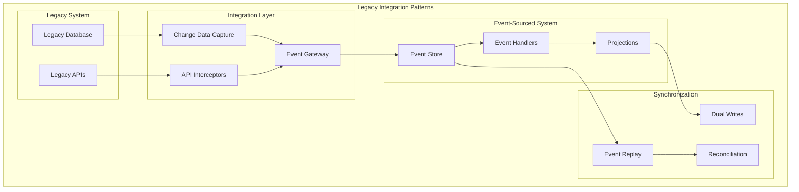

#### Integration Strategies

**Strangler Fig Pattern**: Gradually replace legacy functionality with event-sourced implementations.

**Event Gateway**: Create a translation layer that converts between legacy and event-sourced formats.

**Change Data Capture**: Monitor legacy database changes and convert them to events.

**Dual Write Strategy**: Temporarily write to both legacy and event-sourced systems during migration.

### Microservices Architecture Integration

Event sourcing provides natural boundaries and integration points for microservices architectures.

> **Use Cases**: Explore [Microservices Integration Scenarios](04-use-cases-scenarios.md#microservices-and-distributed-systems) for real-world examples.

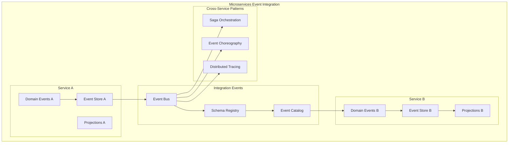

## Influences from Related Technologies

> **Historical Context**: Learn more about these influences in [Origins and Theoretical Foundations](05-origins-theoretical-foundations.md#influences-from-related-disciplines).

### Blockchain Architecture Patterns

Event sourcing shares several architectural principles with blockchain technology, particularly around immutability and append-only structures.

**Similarities**:

- **Append-only logs**: Both maintain chronological, immutable records
- **Cryptographic integrity**: Events can be hashed and chained for verification
- **Consensus mechanisms**: Multiple nodes can agree on event ordering
- **Audit trails**: Complete history of all changes is preserved

**Differences**:

- **Centralization**: Event sourcing typically uses centralized stores vs. blockchain's distributed consensus
- **Performance**: Event sourcing optimizes for throughput vs. blockchain's emphasis on consensus
- **Trust model**: Event sourcing relies on application trust vs. blockchain's trustless model

### Functional Programming Influences

Event sourcing heavily draws from functional programming concepts, particularly around immutable data structures.

> **Deep Dive**: Explore the [Functional Programming Influences](05-origins-theoretical-foundations.md#functional-programming-influences) section for theoretical background.

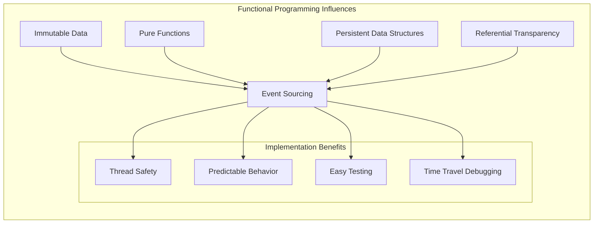

#### Key Concepts Applied

**Immutability**: Events are never modified after creation, similar to immutable data structures in functional languages.

**Structural Sharing**: Event stores can share structure between versions, reducing memory overhead.

**Lazy Evaluation**: Projections can be computed on-demand rather than eagerly maintained.

**Memoization**: Expensive computations can be cached to improve performance.

## Advanced Architectural Patterns

### Multi-Tenant Event Sourcing

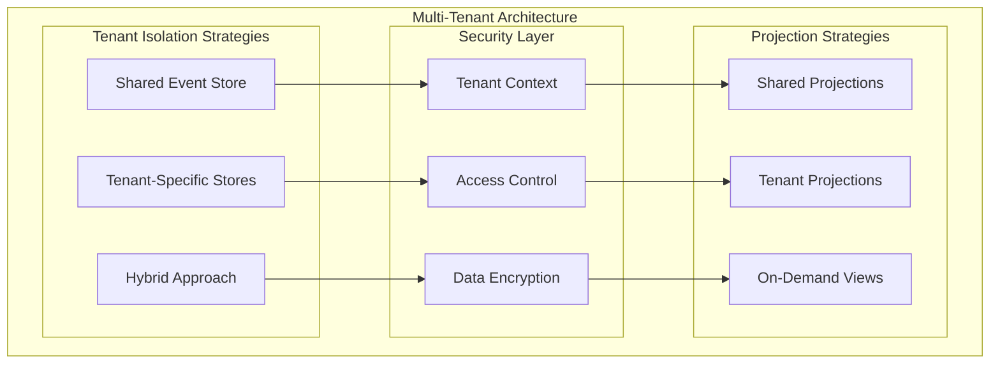

### Event Sourcing in Distributed Systems

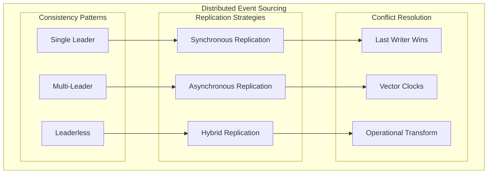

## Security and Compliance Considerations

### Event Security Patterns

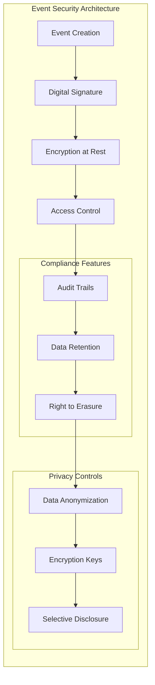

#### Security Implementation Strategies

**Event Signing**: Use digital signatures to ensure event authenticity and non-repudiation.

**Encryption**: Implement field-level or event-level encryption for sensitive data.

**Access Control**: Fine-grained permissions for event reading and writing.

**Audit Compliance**: Built-in audit trails satisfy regulatory requirements.

**Data Anonymization**: Techniques for handling personal data while maintaining event integrity.

## Monitoring and Observability

### Event System Observability

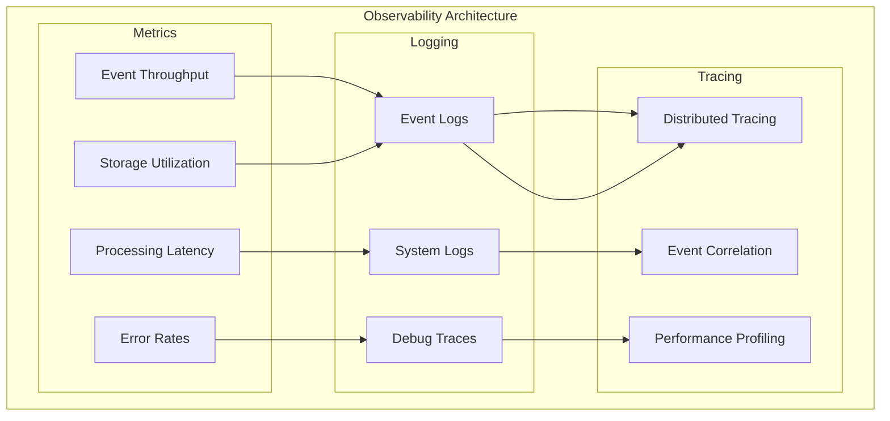

## Conclusion

Event sourcing architectural patterns provide powerful tools for building scalable, auditable, and flexible systems. However, they require careful consideration of consistency models, performance trade-offs, and integration strategies. The patterns outlined in this document serve as a foundation for architects and developers implementing event-sourced systems, whether as greenfield projects or as evolutionary improvements to existing architectures.

The key to successful event sourcing implementation lies in understanding these architectural patterns deeply and applying them judiciously based on specific system requirements, team capabilities, and business constraints.

## See Also

### Implementation Guidance

- **[Implementation Examples](03-implementation-examples.md)** - Code examples and practical implementation of these patterns
- **[Use Cases and Scenarios](04-use-cases-scenarios.md)** - Real-world applications of these architectural patterns

### Foundational Knowledge

- **[Event Sourcing Fundamentals](01-event-sourcing-fundamentals.md)** - Core concepts and principles
- **[Origins and Theoretical Foundations](05-origins-theoretical-foundations.md)** - Historical context and theoretical background

### Specific Pattern References

- [Event Store Architecture Implementations](03-implementation-examples.md#event-store-implementations)
- [CQRS Implementation Examples](03-implementation-examples.md#cqrs-implementation-patterns)
- [Financial Services Architecture](04-use-cases-scenarios.md#financial-technology-fintech)
- [Microservices Integration Patterns](04-use-cases-scenarios.md#microservices-and-distributed-systems)
- [Functional Programming Theory](05-origins-theoretical-foundations.md#functional-programming-influences)

## References

Based on comprehensive analysis of:

- [Event Sourcing Fundamentals](01-event-sourcing-fundamentals.md)
- [Kurrent.io Event Sourcing Guide](references/web_resources_cache/kurrent_io_event_sourcing.md)
- [Wikipedia: Blockchain Architecture](references/web_resources_cache/wikipedia_blockchain.md) 
- [Wikipedia: Purely Functional Data Structures](references/web_resources_cache/wikipedia_purely_functional_data_structures.md)
- Industry best practices from cached resources and practical implementations
- Martin Fowler's work on Event Sourcing and CQRS patterns
- Distributed systems research and patterns

---

*This document complements the fundamental concepts in [Event Sourcing Fundamentals](01-event-sourcing-fundamentals.md) with deep architectural insights for system design and implementation decisions. Continue with [Implementation Examples](03-implementation-examples.md) for practical code patterns.*