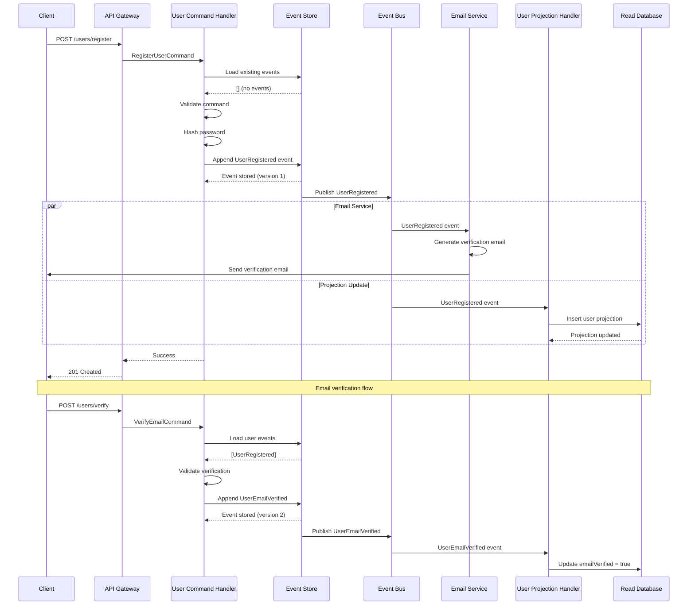
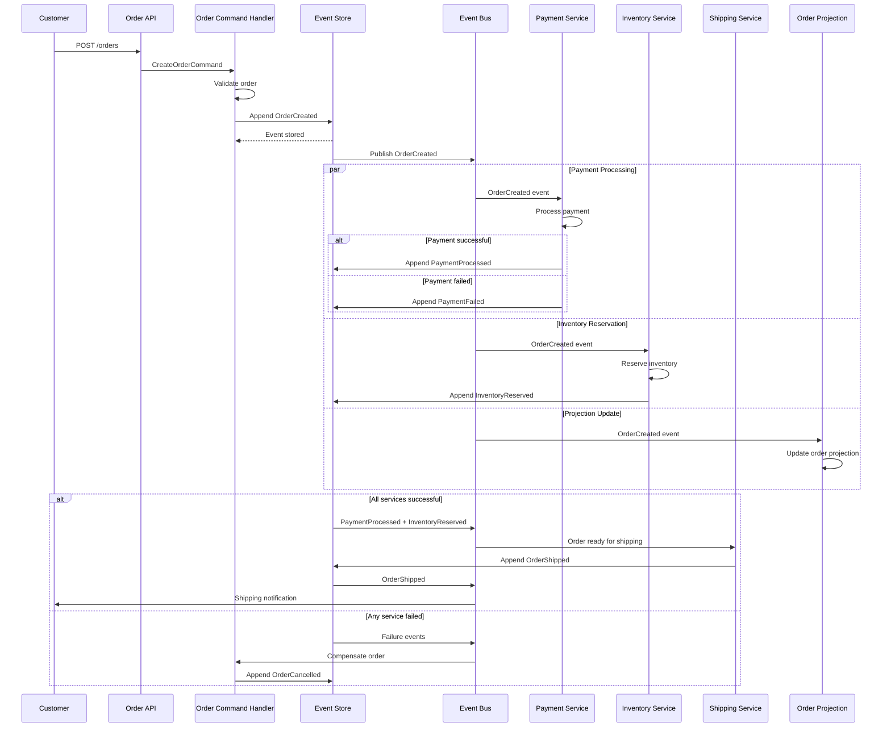
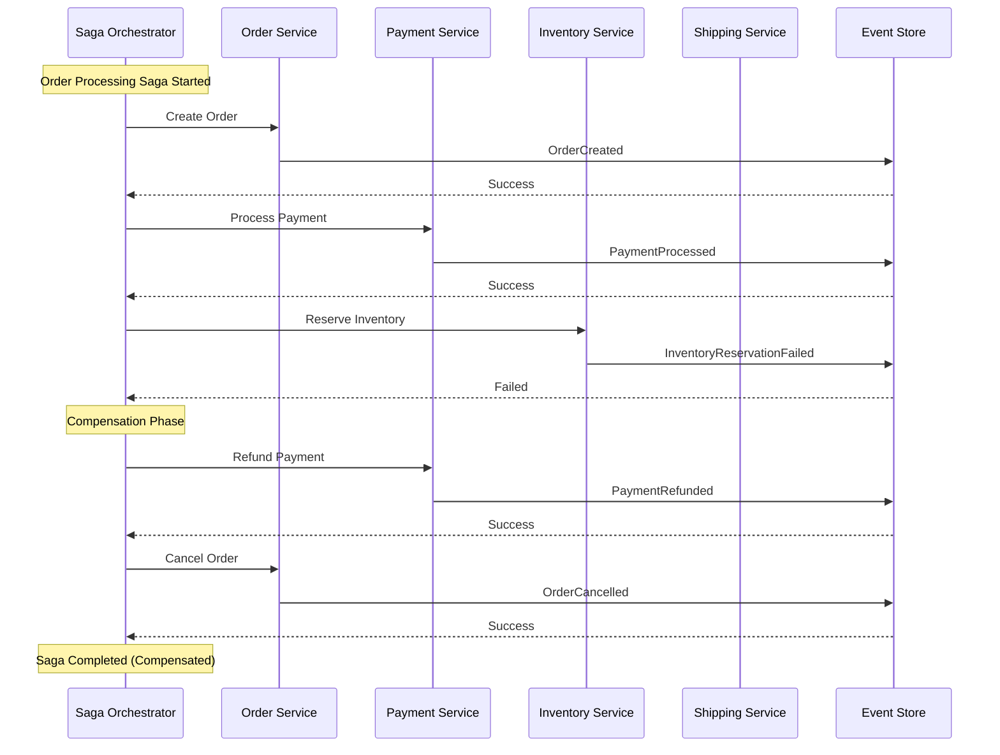

# Event Sourcing Implementation Examples

## Introduction

This document provides comprehensive implementation examples and code patterns for event sourcing systems. Targeted at software engineers and implementation teams, it offers practical, actionable guidance with concrete examples in multiple programming paradigms. The examples demonstrate real-world scenarios, common patterns, and best practices for building robust event-sourced applications.

> **Prerequisites**: Ensure you understand the [Event Sourcing Fundamentals](01-event-sourcing-fundamentals.md) and [Architectural Patterns](02-architectural-patterns.md) before diving into these implementations.
> 
> **Use Cases**: See how these implementations apply to real-world scenarios in [Use Cases and Scenarios](04-use-cases-scenarios.md).

## Event Design Patterns and Schemas

> **Conceptual Foundation**: Review [Events as Core Components](01-event-sourcing-fundamentals.md#core-components) for theoretical background.
> 
> **Architectural Context**: See [Event Store Architecture](02-architectural-patterns.md#event-store-architecture) for system-level design considerations.

### Event Structure and Naming Conventions

Events represent immutable business facts described in past tense. Here's the fundamental event structure:

```typescript
interface DomainEvent {
  readonly eventId: string;           // Unique identifier
  readonly eventType: string;         // Past tense action (e.g., "CustomerRegistered")
  readonly aggregateId: string;       // Entity identifier
  readonly aggregateType: string;     // Entity type
  readonly eventVersion: number;      // Schema version
  readonly timestamp: Date;           // When event occurred
  readonly correlationId?: string;    // Request correlation
  readonly causationId?: string;      // Event that caused this event
  readonly metadata: EventMetadata;   // Additional context
  readonly data: unknown;             // Event-specific payload
}

interface EventMetadata {
  readonly userId?: string;
  readonly sessionId?: string;
  readonly source: string;            // Origin system/service
  readonly traceId?: string;          // Distributed tracing
}
```

### Common Event Patterns

#### 1. State Change Events

```typescript
// User Registration Domain
interface UserRegistered extends DomainEvent {
  readonly eventType: "UserRegistered";
  readonly data: {
    readonly email: string;
    readonly username: string;
    readonly hashedPassword: string;
    readonly registrationMethod: "email" | "oauth" | "invitation";
    readonly verificationRequired: boolean;
  };
}

interface UserEmailVerified extends DomainEvent {
  readonly eventType: "UserEmailVerified";
  readonly data: {
    readonly verificationToken: string;
    readonly verifiedAt: Date;
  };
}

interface UserPasswordChanged extends DomainEvent {
  readonly eventType: "UserPasswordChanged";
  readonly data: {
    readonly hashedPassword: string;
    readonly passwordStrength: number;
    readonly requiresReauthentication: boolean;
  };
}
```

#### 2. Lifecycle Events

```typescript
// Order Processing Domain
interface OrderCreated extends DomainEvent {
  readonly eventType: "OrderCreated";
  readonly data: {
    readonly customerId: string;
    readonly items: OrderItem[];
    readonly totalAmount: number;
    readonly currency: string;
    readonly shippingAddress: Address;
  };
}

interface OrderItemAdded extends DomainEvent {
  readonly eventType: "OrderItemAdded";
  readonly data: {
    readonly productId: string;
    readonly quantity: number;
    readonly unitPrice: number;
    readonly discountApplied?: number;
  };
}

interface OrderShipped extends DomainEvent {
  readonly eventType: "OrderShipped";
  readonly data: {
    readonly trackingNumber: string;
    readonly carrier: string;
    readonly estimatedDelivery: Date;
    readonly shippingMethod: string;
  };
}

interface OrderDelivered extends DomainEvent {
  readonly eventType: "OrderDelivered";
  readonly data: {
    readonly deliveredAt: Date;
    readonly receivedBy?: string;
    readonly deliveryConfirmation: string;
  };
}
```

#### 3. Error and Compensation Events

```typescript
interface PaymentFailed extends DomainEvent {
  readonly eventType: "PaymentFailed";
  readonly data: {
    readonly paymentId: string;
    readonly failureReason: string;
    readonly errorCode: string;
    readonly retryable: boolean;
    readonly nextRetryAt?: Date;
  };
}

interface OrderCancelled extends DomainEvent {
  readonly eventType: "OrderCancelled";
  readonly data: {
    readonly reason: string;
    readonly cancelledBy: string; // "customer" | "system" | "admin"
    readonly refundRequired: boolean;
    readonly restockItems: boolean;
  };
}
```

### Event Schema Evolution

```typescript
// Version 1 - Initial Schema
interface CustomerRegisteredV1 extends DomainEvent {
  readonly eventVersion: 1;
  readonly data: {
    readonly email: string;
    readonly name: string;
  };
}

// Version 2 - Added phone number
interface CustomerRegisteredV2 extends DomainEvent {
  readonly eventVersion: 2;
  readonly data: {
    readonly email: string;
    readonly name: string;
    readonly phoneNumber?: string; // Optional for backward compatibility
  };
}

// Version 3 - Split name into first/last
interface CustomerRegisteredV3 extends DomainEvent {
  readonly eventVersion: 3;
  readonly data: {
    readonly email: string;
    readonly firstName: string;
    readonly lastName: string;
    readonly phoneNumber?: string;
  };
}

// Schema Migration Handler
class EventSchemaUpgrader {
  upgradeEvent(event: DomainEvent): DomainEvent {
    switch (event.eventType) {
      case "CustomerRegistered":
        return this.upgradeCustomerRegistered(event);
      default:
        return event;
    }
  }

  private upgradeCustomerRegistered(event: DomainEvent): DomainEvent {
    switch (event.eventVersion) {
      case 1:
        return this.upgradeCustomerRegisteredV1ToV2(event as CustomerRegisteredV1);
      case 2:
        return this.upgradeCustomerRegisteredV2ToV3(event as CustomerRegisteredV2);
      default:
        return event;
    }
  }

  private upgradeCustomerRegisteredV1ToV2(v1: CustomerRegisteredV1): CustomerRegisteredV2 {
    return {
      ...v1,
      eventVersion: 2,
      data: {
        ...v1.data,
        phoneNumber: undefined
      }
    };
  }

  private upgradeCustomerRegisteredV2ToV3(v2: CustomerRegisteredV2): CustomerRegisteredV3 {
    const [firstName = "", lastName = ""] = v2.data.name.split(" ", 2);
    return {
      ...v2,
      eventVersion: 3,
      data: {
        email: v2.data.email,
        firstName,
        lastName,
        phoneNumber: v2.data.phoneNumber
      }
    };
  }
}
```

## Command and Event Handler Implementations

> **Architectural Context**: Review [CQRS Patterns](02-architectural-patterns.md#command-and-query-responsibility-segregation-cqrs) for the architectural foundation of command/event separation.

### Command Processing Pattern

```typescript
// Command Definition
interface RegisterUserCommand {
  readonly commandType: "RegisterUser";
  readonly email: string;
  readonly username: string;
  readonly password: string;
  readonly registrationMethod: "email" | "oauth";
}

// Command Handler
class UserCommandHandler {
  constructor(
    private eventStore: EventStore,
    private passwordHasher: PasswordHasher,
    private userRepository: UserRepository
  ) {}

  async handle(command: RegisterUserCommand): Promise<void> {
    // Validate command
    await this.validateRegistrationCommand(command);

    // Load existing events for user (if any)
    const existingEvents = await this.eventStore.getEvents(command.email);
    const user = User.fromEvents(existingEvents);

    // Business logic validation
    if (user.isRegistered()) {
      throw new Error("User already registered");
    }

    // Execute business logic
    const hashedPassword = await this.passwordHasher.hash(command.password);
    
    // Generate domain events
    const events: DomainEvent[] = [
      {
        eventId: generateId(),
        eventType: "UserRegistered",
        aggregateId: command.email,
        aggregateType: "User",
        eventVersion: 1,
        timestamp: new Date(),
        correlationId: getCurrentCorrelationId(),
        metadata: {
          source: "user-service",
          userId: command.email
        },
        data: {
          email: command.email,
          username: command.username,
          hashedPassword,
          registrationMethod: command.registrationMethod,
          verificationRequired: command.registrationMethod === "email"
        }
      }
    ];

    // Persist events
    await this.eventStore.appendEvents(command.email, events, user.version);
  }

  private async validateRegistrationCommand(command: RegisterUserCommand): Promise<void> {
    if (!isValidEmail(command.email)) {
      throw new ValidationError("Invalid email format");
    }
    
    if (command.password.length < 8) {
      throw new ValidationError("Password must be at least 8 characters");
    }

    const existingUser = await this.userRepository.findByEmail(command.email);
    if (existingUser) {
      throw new ValidationError("Email already registered");
    }
  }
}
```

### Event Handler Patterns

```typescript
// Event Handler for Projections
class UserProjectionHandler {
  constructor(private database: Database) {}

  async handle(event: DomainEvent): Promise<void> {
    switch (event.eventType) {
      case "UserRegistered":
        await this.handleUserRegistered(event as UserRegistered);
        break;
      case "UserEmailVerified":
        await this.handleUserEmailVerified(event as UserEmailVerified);
        break;
      case "UserPasswordChanged":
        await this.handleUserPasswordChanged(event as UserPasswordChanged);
        break;
      default:
        // Log unhandled event type
        console.warn(`Unhandled event type: ${event.eventType}`);
    }
  }

  private async handleUserRegistered(event: UserRegistered): Promise<void> {
    const userProjection = {
      id: event.aggregateId,
      email: event.data.email,
      username: event.data.username,
      registrationMethod: event.data.registrationMethod,
      emailVerified: !event.data.verificationRequired,
      createdAt: event.timestamp,
      updatedAt: event.timestamp,
      version: event.eventVersion
    };

    await this.database.users.insert(userProjection);
  }

  private async handleUserEmailVerified(event: UserEmailVerified): Promise<void> {
    await this.database.users.update(
      { id: event.aggregateId },
      { 
        emailVerified: true,
        verifiedAt: event.data.verifiedAt,
        updatedAt: event.timestamp
      }
    );
  }

  private async handleUserPasswordChanged(event: UserPasswordChanged): Promise<void> {
    await this.database.users.update(
      { id: event.aggregateId },
      { 
        passwordLastChanged: event.timestamp,
        updatedAt: event.timestamp
      }
    );
  }
}
```

### Idempotent Event Processing

```typescript
// Idempotent Event Handler
class IdempotentEventHandler {
  constructor(
    private database: Database,
    private processedEvents: Set<string> = new Set()
  ) {}

  async handle(event: DomainEvent): Promise<void> {
    // Check if event already processed
    if (await this.isEventProcessed(event.eventId)) {
      console.log(`Event ${event.eventId} already processed, skipping`);
      return;
    }

    // Process event in transaction
    await this.database.transaction(async (tx) => {
      // Mark event as being processed
      await tx.processedEvents.insert({
        eventId: event.eventId,
        processedAt: new Date(),
        status: 'processing'
      });

      try {
        // Process the actual event
        await this.processEvent(event, tx);

        // Mark as completed
        await tx.processedEvents.update(
          { eventId: event.eventId },
          { status: 'completed', completedAt: new Date() }
        );
      } catch (error) {
        // Mark as failed
        await tx.processedEvents.update(
          { eventId: event.eventId },
          { status: 'failed', error: error.message, failedAt: new Date() }
        );
        throw error;
      }
    });
  }

  private async isEventProcessed(eventId: string): Promise<boolean> {
    const processed = await this.database.processedEvents.findOne({ eventId });
    return processed?.status === 'completed';
  }

  private async processEvent(event: DomainEvent, tx: Transaction): Promise<void> {
    // Actual event processing logic here
    switch (event.eventType) {
      case "OrderCreated":
        await this.handleOrderCreated(event as OrderCreated, tx);
        break;
      // Other event types...
    }
  }
}
```

## Projection Building Examples

> **Pattern Overview**: Understanding [Projection Patterns](02-architectural-patterns.md#projection-patterns) will help you choose the right approach for your use case.
> 
> **Real-World Applications**: See how projections solve specific problems in [Analytics Use Cases](04-use-cases-scenarios.md#analytics-and-business-intelligence).

### Real-time Projection Updates

```typescript
// Order Summary Projection
interface OrderSummaryProjection {
  orderId: string;
  customerId: string;
  status: OrderStatus;
  totalAmount: number;
  currency: string;
  itemCount: number;
  createdAt: Date;
  updatedAt: Date;
  shippingAddress?: Address;
  trackingNumber?: string;
}

class OrderSummaryProjectionBuilder {
  constructor(private database: Database) {}

  async buildProjection(events: DomainEvent[]): Promise<OrderSummaryProjection> {
    let projection: Partial<OrderSummaryProjection> = {};

    for (const event of events) {
      projection = this.applyEvent(projection, event);
    }

    return projection as OrderSummaryProjection;
  }

  private applyEvent(
    projection: Partial<OrderSummaryProjection>, 
    event: DomainEvent
  ): Partial<OrderSummaryProjection> {
    switch (event.eventType) {
      case "OrderCreated":
        return this.applyOrderCreated(projection, event as OrderCreated);
      case "OrderItemAdded":
        return this.applyOrderItemAdded(projection, event as OrderItemAdded);
      case "OrderShipped":
        return this.applyOrderShipped(projection, event as OrderShipped);
      case "OrderDelivered":
        return this.applyOrderDelivered(projection, event as OrderDelivered);
      case "OrderCancelled":
        return this.applyOrderCancelled(projection, event as OrderCancelled);
      default:
        return projection;
    }
  }

  private applyOrderCreated(
    projection: Partial<OrderSummaryProjection>,
    event: OrderCreated
  ): Partial<OrderSummaryProjection> {
    return {
      ...projection,
      orderId: event.aggregateId,
      customerId: event.data.customerId,
      status: OrderStatus.Created,
      totalAmount: event.data.totalAmount,
      currency: event.data.currency,
      itemCount: event.data.items.length,
      shippingAddress: event.data.shippingAddress,
      createdAt: event.timestamp,
      updatedAt: event.timestamp
    };
  }

  private applyOrderItemAdded(
    projection: Partial<OrderSummaryProjection>,
    event: OrderItemAdded
  ): Partial<OrderSummaryProjection> {
    const itemTotal = event.data.quantity * event.data.unitPrice - (event.data.discountApplied || 0);
    return {
      ...projection,
      totalAmount: (projection.totalAmount || 0) + itemTotal,
      itemCount: (projection.itemCount || 0) + event.data.quantity,
      updatedAt: event.timestamp
    };
  }

  private applyOrderShipped(
    projection: Partial<OrderSummaryProjection>,
    event: OrderShipped
  ): Partial<OrderSummaryProjection> {
    return {
      ...projection,
      status: OrderStatus.Shipped,
      trackingNumber: event.data.trackingNumber,
      updatedAt: event.timestamp
    };
  }

  private applyOrderDelivered(
    projection: Partial<OrderSummaryProjection>,
    event: OrderDelivered
  ): Partial<OrderSummaryProjection> {
    return {
      ...projection,
      status: OrderStatus.Delivered,
      updatedAt: event.timestamp
    };
  }

  private applyOrderCancelled(
    projection: Partial<OrderSummaryProjection>,
    event: OrderCancelled
  ): Partial<OrderSummaryProjection> {
    return {
      ...projection,
      status: OrderStatus.Cancelled,
      updatedAt: event.timestamp
    };
  }
}
```

### Batch Projection Rebuilding

```typescript
// Projection Rebuilder for handling large datasets
class ProjectionRebuilder {
  constructor(
    private eventStore: EventStore,
    private projectionStore: ProjectionStore,
    private batchSize: number = 1000
  ) {}

  async rebuildProjection(
    projectionName: string,
    fromTimestamp?: Date
  ): Promise<void> {
    console.log(`Starting rebuild of ${projectionName} projection`);
    
    // Clear existing projection data
    await this.projectionStore.clear(projectionName);
    
    let processedEvents = 0;
    let lastTimestamp = fromTimestamp || new Date(0);
    
    while (true) {
      // Get batch of events
      const events = await this.eventStore.getEventsBatch(
        lastTimestamp,
        this.batchSize
      );
      
      if (events.length === 0) {
        break;
      }
      
      // Process batch
      await this.processBatch(projectionName, events);
      
      processedEvents += events.length;
      lastTimestamp = events[events.length - 1].timestamp;
      
      console.log(`Processed ${processedEvents} events for ${projectionName}`);
      
      // Prevent overwhelming the system
      if (events.length < this.batchSize) {
        break;
      }
      
      // Small delay between batches
      await this.delay(100);
    }
    
    console.log(`Completed rebuild of ${projectionName}. Total events: ${processedEvents}`);
  }

  private async processBatch(projectionName: string, events: DomainEvent[]): Promise<void> {
    const projectionBuilder = this.getProjectionBuilder(projectionName);
    
    // Group events by aggregate ID for efficient processing
    const eventsByAggregate = this.groupEventsByAggregate(events);
    
    // Process each aggregate's events
    for (const [aggregateId, aggregateEvents] of eventsByAggregate) {
      const projection = await projectionBuilder.buildProjection(aggregateEvents);
      await this.projectionStore.upsert(projectionName, aggregateId, projection);
    }
  }

  private groupEventsByAggregate(events: DomainEvent[]): Map<string, DomainEvent[]> {
    const grouped = new Map<string, DomainEvent[]>();
    
    for (const event of events) {
      const aggregateEvents = grouped.get(event.aggregateId) || [];
      aggregateEvents.push(event);
      grouped.set(event.aggregateId, aggregateEvents);
    }
    
    // Sort events within each aggregate by timestamp
    for (const aggregateEvents of grouped.values()) {
      aggregateEvents.sort((a, b) => a.timestamp.getTime() - b.timestamp.getTime());
    }
    
    return grouped;
  }

  private getProjectionBuilder(projectionName: string): ProjectionBuilder {
    switch (projectionName) {
      case "order-summary":
        return new OrderSummaryProjectionBuilder(this.projectionStore.database);
      case "user-profile":
        return new UserProfileProjectionBuilder(this.projectionStore.database);
      default:
        throw new Error(`Unknown projection: ${projectionName}`);
    }
  }

  private delay(ms: number): Promise<void> {
    return new Promise(resolve => setTimeout(resolve, ms));
  }
}
```

## State Reconstruction Algorithms

### Snapshot-based State Reconstruction

```typescript
// Aggregate Root Base Class
abstract class AggregateRoot {
  protected version: number = 0;
  protected uncommittedEvents: DomainEvent[] = [];

  abstract getId(): string;
  abstract getType(): string;

  getVersion(): number {
    return this.version;
  }

  getUncommittedEvents(): DomainEvent[] {
    return [...this.uncommittedEvents];
  }

  markEventsAsCommitted(): void {
    this.uncommittedEvents = [];
  }

  protected addEvent(event: DomainEvent): void {
    this.uncommittedEvents.push(event);
    this.applyEvent(event);
    this.version++;
  }

  protected abstract applyEvent(event: DomainEvent): void;

  // State reconstruction from events
  static fromEvents<T extends AggregateRoot>(
    this: new () => T,
    events: DomainEvent[]
  ): T {
    const aggregate = new this();
    
    for (const event of events) {
      aggregate.applyEvent(event);
      aggregate.version++;
    }
    
    return aggregate;
  }

  // State reconstruction with snapshot
  static fromSnapshot<T extends AggregateRoot>(
    this: new () => T,
    snapshot: AggregateSnapshot,
    events: DomainEvent[]
  ): T {
    const aggregate = new this();
    
    // Apply snapshot
    aggregate.applySnapshot(snapshot);
    
    // Apply events since snapshot
    for (const event of events) {
      if (event.timestamp > snapshot.timestamp) {
        aggregate.applyEvent(event);
        aggregate.version++;
      }
    }
    
    return aggregate;
  }

  protected abstract applySnapshot(snapshot: AggregateSnapshot): void;
  abstract createSnapshot(): AggregateSnapshot;
}

// Concrete Implementation - User Aggregate
class User extends AggregateRoot {
  private id: string = "";
  private email: string = "";
  private username: string = "";
  private hashedPassword: string = "";
  private emailVerified: boolean = false;
  private registrationMethod: "email" | "oauth" | "invitation" = "email";
  private createdAt: Date = new Date();
  private lastLoginAt?: Date;

  getId(): string {
    return this.id;
  }

  getType(): string {
    return "User";
  }

  isRegistered(): boolean {
    return this.id !== "";
  }

  // Business methods
  static register(
    email: string,
    username: string,
    hashedPassword: string,
    registrationMethod: "email" | "oauth" | "invitation"
  ): User {
    const user = new User();
    
    const event: UserRegistered = {
      eventId: generateId(),
      eventType: "UserRegistered",
      aggregateId: email,
      aggregateType: "User",
      eventVersion: 1,
      timestamp: new Date(),
      metadata: { source: "user-service" },
      data: {
        email,
        username,
        hashedPassword,
        registrationMethod,
        verificationRequired: registrationMethod === "email"
      }
    };
    
    user.addEvent(event);
    return user;
  }

  verifyEmail(verificationToken: string): void {
    if (this.emailVerified) {
      throw new Error("Email already verified");
    }

    const event: UserEmailVerified = {
      eventId: generateId(),
      eventType: "UserEmailVerified",
      aggregateId: this.id,
      aggregateType: "User",
      eventVersion: 1,
      timestamp: new Date(),
      metadata: { source: "user-service" },
      data: {
        verificationToken,
        verifiedAt: new Date()
      }
    };

    this.addEvent(event);
  }

  // Event application
  protected applyEvent(event: DomainEvent): void {
    switch (event.eventType) {
      case "UserRegistered":
        this.applyUserRegistered(event as UserRegistered);
        break;
      case "UserEmailVerified":
        this.applyUserEmailVerified(event as UserEmailVerified);
        break;
      case "UserPasswordChanged":
        this.applyUserPasswordChanged(event as UserPasswordChanged);
        break;
      default:
        throw new Error(`Unknown event type: ${event.eventType}`);
    }
  }

  private applyUserRegistered(event: UserRegistered): void {
    this.id = event.aggregateId;
    this.email = event.data.email;
    this.username = event.data.username;
    this.hashedPassword = event.data.hashedPassword;
    this.registrationMethod = event.data.registrationMethod;
    this.emailVerified = !event.data.verificationRequired;
    this.createdAt = event.timestamp;
  }

  private applyUserEmailVerified(event: UserEmailVerified): void {
    this.emailVerified = true;
  }

  private applyUserPasswordChanged(event: UserPasswordChanged): void {
    this.hashedPassword = event.data.hashedPassword;
  }

  // Snapshot support
  protected applySnapshot(snapshot: AggregateSnapshot): void {
    const userSnapshot = snapshot as UserSnapshot;
    this.id = userSnapshot.id;
    this.email = userSnapshot.email;
    this.username = userSnapshot.username;
    this.hashedPassword = userSnapshot.hashedPassword;
    this.emailVerified = userSnapshot.emailVerified;
    this.registrationMethod = userSnapshot.registrationMethod;
    this.createdAt = userSnapshot.createdAt;
    this.lastLoginAt = userSnapshot.lastLoginAt;
    this.version = userSnapshot.version;
  }

  createSnapshot(): UserSnapshot {
    return {
      id: this.id,
      email: this.email,
      username: this.username,
      hashedPassword: this.hashedPassword,
      emailVerified: this.emailVerified,
      registrationMethod: this.registrationMethod,
      createdAt: this.createdAt,
      lastLoginAt: this.lastLoginAt,
      version: this.version,
      timestamp: new Date()
    };
  }
}

// Snapshot interfaces
interface AggregateSnapshot {
  readonly version: number;
  readonly timestamp: Date;
}

interface UserSnapshot extends AggregateSnapshot {
  readonly id: string;
  readonly email: string;
  readonly username: string;
  readonly hashedPassword: string;
  readonly emailVerified: boolean;
  readonly registrationMethod: "email" | "oauth" | "invitation";
  readonly createdAt: Date;
  readonly lastLoginAt?: Date;
}
```

### Optimized State Reconstruction with Caching

```typescript
// Repository with caching and snapshot support
class UserRepository {
  private cache = new Map<string, User>();
  private snapshotCache = new Map<string, UserSnapshot>();

  constructor(
    private eventStore: EventStore,
    private snapshotStore: SnapshotStore,
    private snapshotFrequency: number = 10 // Create snapshot every 10 events
  ) {}

  async findById(userId: string): Promise<User | null> {
    // Check cache first
    if (this.cache.has(userId)) {
      return this.cache.get(userId)!;
    }

    // Try to load from snapshot + events
    const user = await this.loadFromSnapshotAndEvents(userId);
    
    if (user) {
      this.cache.set(userId, user);
    }
    
    return user;
  }

  async save(user: User): Promise<void> {
    const events = user.getUncommittedEvents();
    
    if (events.length === 0) {
      return;
    }

    // Append events to store
    await this.eventStore.appendEvents(user.getId(), events, user.getVersion() - events.length);
    
    // Mark events as committed
    user.markEventsAsCommitted();
    
    // Update cache
    this.cache.set(user.getId(), user);
    
    // Create snapshot if needed
    if (user.getVersion() % this.snapshotFrequency === 0) {
      const snapshot = user.createSnapshot();
      await this.snapshotStore.saveSnapshot(user.getId(), snapshot);
      this.snapshotCache.set(user.getId(), snapshot);
    }
  }

  private async loadFromSnapshotAndEvents(userId: string): Promise<User | null> {
    try {
      // Get latest snapshot
      const snapshot = await this.getLatestSnapshot(userId);
      
      if (snapshot) {
        // Load events since snapshot
        const events = await this.eventStore.getEventsAfter(userId, snapshot.timestamp);
        return User.fromSnapshot(snapshot, events);
      } else {
        // Load all events
        const events = await this.eventStore.getEvents(userId);
        
        if (events.length === 0) {
          return null;
        }
        
        return User.fromEvents(events);
      }
    } catch (error) {
      console.error(`Error loading user ${userId}:`, error);
      return null;
    }
  }

  private async getLatestSnapshot(userId: string): Promise<UserSnapshot | null> {
    // Check cache first
    if (this.snapshotCache.has(userId)) {
      return this.snapshotCache.get(userId)!;
    }

    // Load from store
    const snapshot = await this.snapshotStore.getLatestSnapshot(userId);
    
    if (snapshot) {
      this.snapshotCache.set(userId, snapshot as UserSnapshot);
    }
    
    return snapshot as UserSnapshot | null;
  }

  // Cache management
  clearCache(): void {
    this.cache.clear();
    this.snapshotCache.clear();
  }

  removeCachedUser(userId: string): void {
    this.cache.delete(userId);
    this.snapshotCache.delete(userId);
  }
}
```

## Event Flow Sequence Diagrams

### User Registration Flow



### Order Processing Flow



### Saga Pattern for Distributed Transactions



## Implementation Patterns for Common Scenarios

### E-commerce Order Processing

```python
# Python implementation with comprehensive error handling
from typing import List, Optional, Dict, Any
from dataclasses import dataclass
from datetime import datetime
from enum import Enum
import uuid

class OrderStatus(Enum):
    CREATED = "created"
    PAYMENT_PENDING = "payment_pending"
    PAID = "paid"
    SHIPPED = "shipped"
    DELIVERED = "delivered"
    CANCELLED = "cancelled"

@dataclass(frozen=True)
class OrderItem:
    product_id: str
    quantity: int
    unit_price: float
    discount: float = 0.0

@dataclass(frozen=True)
class Address:
    street: str
    city: str
    state: str
    zip_code: str
    country: str

class OrderAggregate:
    def __init__(self):
        self.order_id: Optional[str] = None
        self.customer_id: Optional[str] = None
        self.items: List[OrderItem] = []
        self.status = OrderStatus.CREATED
        self.total_amount = 0.0
        self.currency = "USD"
        self.shipping_address: Optional[Address] = None
        self.tracking_number: Optional[str] = None
        self.version = 0
        self.uncommitted_events: List[Dict[str, Any]] = []

    @classmethod
    def create_order(
        cls,
        customer_id: str,
        items: List[OrderItem],
        shipping_address: Address,
        currency: str = "USD"
    ) -> 'OrderAggregate':
        """Create a new order aggregate with validation"""
        
        # Validation
        if not items:
            raise ValueError("Order must contain at least one item")
        
        if any(item.quantity <= 0 for item in items):
            raise ValueError("All items must have positive quantity")
        
        # Calculate total
        total_amount = sum(
            item.quantity * item.unit_price - item.discount 
            for item in items
        )
        
        if total_amount <= 0:
            raise ValueError("Order total must be positive")
        
        # Create aggregate
        order = cls()
        order._add_event({
            "event_id": str(uuid.uuid4()),
            "event_type": "OrderCreated",
            "aggregate_id": str(uuid.uuid4()),
            "aggregate_type": "Order",
            "timestamp": datetime.utcnow().isoformat(),
            "data": {
                "customer_id": customer_id,
                "items": [
                    {
                        "product_id": item.product_id,
                        "quantity": item.quantity,
                        "unit_price": item.unit_price,
                        "discount": item.discount
                    }
                    for item in items
                ],
                "total_amount": total_amount,
                "currency": currency,
                "shipping_address": {
                    "street": shipping_address.street,
                    "city": shipping_address.city,
                    "state": shipping_address.state,
                    "zip_code": shipping_address.zip_code,
                    "country": shipping_address.country
                }
            }
        })
        
        return order

    def process_payment(self, payment_id: str, amount: float) -> None:
        """Process payment for the order"""
        if self.status != OrderStatus.CREATED:
            raise ValueError(f"Cannot process payment for order in status: {self.status}")
        
        if amount != self.total_amount:
            raise ValueError(f"Payment amount {amount} does not match order total {self.total_amount}")
        
        self._add_event({
            "event_id": str(uuid.uuid4()),
            "event_type": "PaymentProcessed",
            "aggregate_id": self.order_id,
            "aggregate_type": "Order",
            "timestamp": datetime.utcnow().isoformat(),
            "data": {
                "payment_id": payment_id,
                "amount": amount,
                "currency": self.currency
            }
        })

    def ship_order(self, tracking_number: str, carrier: str) -> None:
        """Ship the order"""
        if self.status != OrderStatus.PAID:
            raise ValueError(f"Cannot ship order in status: {self.status}")
        
        self._add_event({
            "event_id": str(uuid.uuid4()),
            "event_type": "OrderShipped",
            "aggregate_id": self.order_id,
            "aggregate_type": "Order",
            "timestamp": datetime.utcnow().isoformat(),
            "data": {
                "tracking_number": tracking_number,
                "carrier": carrier,
                "estimated_delivery": (datetime.utcnow().replace(hour=0, minute=0, second=0) + 
                                     timedelta(days=3)).isoformat()
            }
        })

    def cancel_order(self, reason: str, cancelled_by: str) -> None:
        """Cancel the order"""
        if self.status in [OrderStatus.DELIVERED, OrderStatus.CANCELLED]:
            raise ValueError(f"Cannot cancel order in status: {self.status}")
        
        self._add_event({
            "event_id": str(uuid.uuid4()),
            "event_type": "OrderCancelled",
            "aggregate_id": self.order_id,
            "aggregate_type": "Order",
            "timestamp": datetime.utcnow().isoformat(),
            "data": {
                "reason": reason,
                "cancelled_by": cancelled_by,
                "refund_required": self.status == OrderStatus.PAID,
                "restock_items": True
            }
        })

    def _add_event(self, event: Dict[str, Any]) -> None:
        """Add event and apply it to the aggregate"""
        self.uncommitted_events.append(event)
        self._apply_event(event)
        self.version += 1

    def _apply_event(self, event: Dict[str, Any]) -> None:
        """Apply event to aggregate state"""
        event_type = event["event_type"]
        data = event["data"]
        
        if event_type == "OrderCreated":
            self.order_id = event["aggregate_id"]
            self.customer_id = data["customer_id"]
            self.items = [
                OrderItem(
                    product_id=item["product_id"],
                    quantity=item["quantity"],
                    unit_price=item["unit_price"],
                    discount=item["discount"]
                )
                for item in data["items"]
            ]
            self.total_amount = data["total_amount"]
            self.currency = data["currency"]
            self.shipping_address = Address(
                street=data["shipping_address"]["street"],
                city=data["shipping_address"]["city"],
                state=data["shipping_address"]["state"],
                zip_code=data["shipping_address"]["zip_code"],
                country=data["shipping_address"]["country"]
            )
            self.status = OrderStatus.CREATED
            
        elif event_type == "PaymentProcessed":
            self.status = OrderStatus.PAID
            
        elif event_type == "OrderShipped":
            self.status = OrderStatus.SHIPPED
            self.tracking_number = data["tracking_number"]
            
        elif event_type == "OrderDelivered":
            self.status = OrderStatus.DELIVERED
            
        elif event_type == "OrderCancelled":
            self.status = OrderStatus.CANCELLED

    @classmethod
    def from_events(cls, events: List[Dict[str, Any]]) -> 'OrderAggregate':
        """Reconstruct aggregate from events"""
        order = cls()
        
        for event in sorted(events, key=lambda e: e["timestamp"]):
            order._apply_event(event)
            order.version += 1
            
        return order

    def get_uncommitted_events(self) -> List[Dict[str, Any]]:
        """Get uncommitted events"""
        return self.uncommitted_events.copy()

    def mark_events_as_committed(self) -> None:
        """Mark events as committed"""
        self.uncommitted_events.clear()
```

### Banking Account Management

```java
// Java implementation with comprehensive business rules
import java.math.BigDecimal;
import java.time.Instant;
import java.util.*;

public class BankAccount {
    private String accountId;
    private String customerId;
    private BigDecimal balance;
    private BigDecimal dailyWithdrawalLimit;
    private BigDecimal dailyWithdrawalAmount;
    private boolean frozen;
    private int version;
    private List<DomainEvent> uncommittedEvents;

    public BankAccount() {
        this.balance = BigDecimal.ZERO;
        this.dailyWithdrawalAmount = BigDecimal.ZERO;
        this.frozen = false;
        this.version = 0;
        this.uncommittedEvents = new ArrayList<>();
    }

    // Factory method
    public static BankAccount openAccount(String customerId, BigDecimal initialDeposit, 
                                         BigDecimal dailyWithdrawalLimit) {
        if (initialDeposit.compareTo(BigDecimal.ZERO) < 0) {
            throw new IllegalArgumentException("Initial deposit cannot be negative");
        }
        
        if (dailyWithdrawalLimit.compareTo(BigDecimal.ZERO) <= 0) {
            throw new IllegalArgumentException("Daily withdrawal limit must be positive");
        }

        BankAccount account = new BankAccount();
        String accountId = UUID.randomUUID().toString();
        
        AccountOpenedEvent event = new AccountOpenedEvent(
            UUID.randomUUID().toString(),
            accountId,
            Instant.now(),
            customerId,
            initialDeposit,
            dailyWithdrawalLimit
        );
        
        account.addEvent(event);
        return account;
    }

    // Business operations
    public void deposit(BigDecimal amount, String description) {
        if (frozen) {
            throw new IllegalStateException("Cannot deposit to frozen account");
        }
        
        if (amount.compareTo(BigDecimal.ZERO) <= 0) {
            throw new IllegalArgumentException("Deposit amount must be positive");
        }

        MoneyDepositedEvent event = new MoneyDepositedEvent(
            UUID.randomUUID().toString(),
            accountId,
            Instant.now(),
            amount,
            description
        );
        
        addEvent(event);
    }

    public void withdraw(BigDecimal amount, String description) {
        if (frozen) {
            throw new IllegalStateException("Cannot withdraw from frozen account");
        }
        
        if (amount.compareTo(BigDecimal.ZERO) <= 0) {
            throw new IllegalArgumentException("Withdrawal amount must be positive");
        }
        
        if (balance.compareTo(amount) < 0) {
            throw new IllegalStateException("Insufficient funds");
        }
        
        BigDecimal newDailyTotal = dailyWithdrawalAmount.add(amount);
        if (newDailyTotal.compareTo(dailyWithdrawalLimit) > 0) {
            throw new IllegalStateException("Daily withdrawal limit exceeded");
        }

        MoneyWithdrawnEvent event = new MoneyWithdrawnEvent(
            UUID.randomUUID().toString(),
            accountId,
            Instant.now(),
            amount,
            description
        );
        
        addEvent(event);
    }

    public void transfer(String toAccountId, BigDecimal amount, String description) {
        if (frozen) {
            throw new IllegalStateException("Cannot transfer from frozen account");
        }
        
        if (amount.compareTo(BigDecimal.ZERO) <= 0) {
            throw new IllegalArgumentException("Transfer amount must be positive");
        }
        
        if (balance.compareTo(amount) < 0) {
            throw new IllegalStateException("Insufficient funds for transfer");
        }

        MoneyTransferredEvent event = new MoneyTransferredEvent(
            UUID.randomUUID().toString(),
            accountId,
            Instant.now(),
            toAccountId,
            amount,
            description
        );
        
        addEvent(event);
    }

    public void freeze(String reason) {
        if (frozen) {
            return; // Already frozen
        }

        AccountFrozenEvent event = new AccountFrozenEvent(
            UUID.randomUUID().toString(),
            accountId,
            Instant.now(),
            reason
        );
        
        addEvent(event);
    }

    public void unfreeze() {
        if (!frozen) {
            return; // Already unfrozen
        }

        AccountUnfrozenEvent event = new AccountUnfrozenEvent(
            UUID.randomUUID().toString(),
            accountId,
            Instant.now()
        );
        
        addEvent(event);
    }

    // Event handling
    private void addEvent(DomainEvent event) {
        uncommittedEvents.add(event);
        applyEvent(event);
        version++;
    }

    private void applyEvent(DomainEvent event) {
        switch (event.getEventType()) {
            case "AccountOpened":
                apply((AccountOpenedEvent) event);
                break;
            case "MoneyDeposited":
                apply((MoneyDepositedEvent) event);
                break;
            case "MoneyWithdrawn":
                apply((MoneyWithdrawnEvent) event);
                break;
            case "MoneyTransferred":
                apply((MoneyTransferredEvent) event);
                break;
            case "AccountFrozen":
                apply((AccountFrozenEvent) event);
                break;
            case "AccountUnfrozen":
                apply((AccountUnfrozenEvent) event);
                break;
            default:
                throw new UnsupportedOperationException("Unknown event type: " + event.getEventType());
        }
    }

    private void apply(AccountOpenedEvent event) {
        this.accountId = event.getAccountId();
        this.customerId = event.getCustomerId();
        this.balance = event.getInitialDeposit();
        this.dailyWithdrawalLimit = event.getDailyWithdrawalLimit();
    }

    private void apply(MoneyDepositedEvent event) {
        this.balance = this.balance.add(event.getAmount());
    }

    private void apply(MoneyWithdrawnEvent event) {
        this.balance = this.balance.subtract(event.getAmount());
        this.dailyWithdrawalAmount = this.dailyWithdrawalAmount.add(event.getAmount());
    }

    private void apply(MoneyTransferredEvent event) {
        this.balance = this.balance.subtract(event.getAmount());
    }

    private void apply(AccountFrozenEvent event) {
        this.frozen = true;
    }

    private void apply(AccountUnfrozenEvent event) {
        this.frozen = false;
    }

    // State reconstruction
    public static BankAccount fromEvents(List<DomainEvent> events) {
        BankAccount account = new BankAccount();
        
        for (DomainEvent event : events) {
            account.applyEvent(event);
            account.version++;
        }
        
        return account;
    }

    // Getters
    public String getAccountId() { return accountId; }
    public BigDecimal getBalance() { return balance; }
    public boolean isFrozen() { return frozen; }
    public int getVersion() { return version; }
    
    public List<DomainEvent> getUncommittedEvents() {
        return new ArrayList<>(uncommittedEvents);
    }
    
    public void markEventsAsCommitted() {
        uncommittedEvents.clear();
    }

    // Daily limit reset (typically called by a scheduled process)
    public void resetDailyWithdrawalAmount() {
        DailyLimitResetEvent event = new DailyLimitResetEvent(
            UUID.randomUUID().toString(),
            accountId,
            Instant.now(),
            dailyWithdrawalAmount
        );
        
        addEvent(event);
    }

    private void apply(DailyLimitResetEvent event) {
        this.dailyWithdrawalAmount = BigDecimal.ZERO;
    }
}

// Event classes would be defined here...
class AccountOpenedEvent implements DomainEvent {
    private final String eventId;
    private final String accountId;
    private final Instant timestamp;
    private final String customerId;
    private final BigDecimal initialDeposit;
    private final BigDecimal dailyWithdrawalLimit;
    
    // Constructor and getters...
    
    @Override
    public String getEventType() {
        return "AccountOpened";
    }
}
```

## Error Handling and Recovery Patterns

### Retry and Circuit Breaker Patterns

```typescript
// Resilient Event Processing with Circuit Breaker
class ResilientEventProcessor {
  private circuitBreaker: CircuitBreaker;
  private retryPolicy: RetryPolicy;
  private deadLetterQueue: DeadLetterQueue;

  constructor(
    private eventHandler: EventHandler,
    circuitBreakerConfig: CircuitBreakerConfig,
    retryConfig: RetryConfig
  ) {
    this.circuitBreaker = new CircuitBreaker(circuitBreakerConfig);
    this.retryPolicy = new RetryPolicy(retryConfig);
    this.deadLetterQueue = new DeadLetterQueue();
  }

  async processEvent(event: DomainEvent): Promise<void> {
    const eventId = event.eventId;
    
    try {
      await this.circuitBreaker.execute(async () => {
        await this.retryPolicy.execute(async () => {
          await this.eventHandler.handle(event);
        });
      });
      
      console.log(`Successfully processed event ${eventId}`);
      
    } catch (error) {
      console.error(`Failed to process event ${eventId}:`, error);
      
      // Send to dead letter queue for manual processing
      await this.deadLetterQueue.send(event, error);
      
      // Record failure metrics
      this.recordFailureMetrics(event, error);
    }
  }

  private recordFailureMetrics(event: DomainEvent, error: Error): void {
    // Record metrics for monitoring
    metrics.counter('event_processing_failures').increment({
      event_type: event.eventType,
      error_type: error.constructor.name
    });
  }
}

class CircuitBreaker {
  private state: 'CLOSED' | 'OPEN' | 'HALF_OPEN' = 'CLOSED';
  private failureCount = 0;
  private lastFailureTime = 0;

  constructor(private config: CircuitBreakerConfig) {}

  async execute<T>(operation: () => Promise<T>): Promise<T> {
    if (this.state === 'OPEN') {
      if (Date.now() - this.lastFailureTime > this.config.resetTimeout) {
        this.state = 'HALF_OPEN';
      } else {
        throw new Error('Circuit breaker is OPEN');
      }
    }

    try {
      const result = await operation();
      
      if (this.state === 'HALF_OPEN') {
        this.state = 'CLOSED';
        this.failureCount = 0;
      }
      
      return result;
      
    } catch (error) {
      this.failureCount++;
      this.lastFailureTime = Date.now();
      
      if (this.failureCount >= this.config.failureThreshold) {
        this.state = 'OPEN';
      }
      
      throw error;
    }
  }
}

class RetryPolicy {
  constructor(private config: RetryConfig) {}

  async execute<T>(operation: () => Promise<T>): Promise<T> {
    let lastError: Error | null = null;
    
    for (let attempt = 0; attempt <= this.config.maxAttempts; attempt++) {
      try {
        return await operation();
      } catch (error) {
        lastError = error as Error;
        
        if (attempt === this.config.maxAttempts) {
          break;
        }
        
        if (!this.isRetryableError(error)) {
          throw error;
        }
        
        const delay = this.calculateDelay(attempt);
        await this.delay(delay);
      }
    }
    
    throw lastError;
  }

  private isRetryableError(error: unknown): boolean {
    // Define which errors are retryable
    if (error instanceof NetworkError) return true;
    if (error instanceof TemporaryServiceError) return true;
    if (error instanceof DatabaseConnectionError) return true;
    
    return false;
  }

  private calculateDelay(attempt: number): number {
    // Exponential backoff with jitter
    const baseDelay = this.config.baseDelay;
    const maxDelay = this.config.maxDelay;
    
    const exponentialDelay = Math.min(
      baseDelay * Math.pow(2, attempt),
      maxDelay
    );
    
    // Add jitter to prevent thundering herd
    const jitter = Math.random() * 0.1 * exponentialDelay;
    
    return exponentialDelay + jitter;
  }

  private delay(ms: number): Promise<void> {
    return new Promise(resolve => setTimeout(resolve, ms));
  }
}

interface CircuitBreakerConfig {
  failureThreshold: number;
  resetTimeout: number;
}

interface RetryConfig {
  maxAttempts: number;
  baseDelay: number;
  maxDelay: number;
}
```

### Event Replay and Recovery

```typescript
// Event Replay Service for Recovery
class EventReplayService {
  constructor(
    private eventStore: EventStore,
    private eventProcessor: EventProcessor,
    private checkpointStore: CheckpointStore
  ) {}

  async replayEvents(
    fromTimestamp: Date,
    toTimestamp?: Date,
    eventTypeFilter?: string[]
  ): Promise<void> {
    console.log(`Starting event replay from ${fromTimestamp}`);
    
    const batchSize = 1000;
    let lastProcessedTimestamp = fromTimestamp;
    let totalEvents = 0;

    try {
      while (true) {
        // Get batch of events
        const events = await this.eventStore.getEventsBatch(
          lastProcessedTimestamp,
          toTimestamp,
          batchSize,
          eventTypeFilter
        );

        if (events.length === 0) {
          break;
        }

        // Process batch
        await this.processBatch(events);
        
        totalEvents += events.length;
        lastProcessedTimestamp = events[events.length - 1].timestamp;
        
        // Save checkpoint
        await this.checkpointStore.saveCheckpoint(
          'replay',
          lastProcessedTimestamp,
          totalEvents
        );
        
        console.log(`Replayed ${totalEvents} events, current timestamp: ${lastProcessedTimestamp}`);
        
        // Break if we've reached the target
        if (toTimestamp && lastProcessedTimestamp >= toTimestamp) {
          break;
        }
        
        // Prevent overwhelming the system
        await this.delay(100);
      }
      
      console.log(`Replay completed. Total events processed: ${totalEvents}`);
      
    } catch (error) {
      console.error('Event replay failed:', error);
      
      // Save failure checkpoint
      await this.checkpointStore.saveCheckpoint(
        'replay_failed',
        lastProcessedTimestamp,
        totalEvents,
        error.message
      );
      
      throw error;
    }
  }

  async resumeReplay(): Promise<void> {
    const checkpoint = await this.checkpointStore.getLatestCheckpoint('replay');
    
    if (!checkpoint) {
      throw new Error('No replay checkpoint found');
    }
    
    console.log(`Resuming replay from checkpoint: ${checkpoint.timestamp}`);
    
    await this.replayEvents(checkpoint.timestamp);
  }

  private async processBatch(events: DomainEvent[]): Promise<void> {
    const failedEvents: Array<{ event: DomainEvent; error: Error }> = [];
    
    for (const event of events) {
      try {
        await this.eventProcessor.processEvent(event);
      } catch (error) {
        console.error(`Failed to replay event ${event.eventId}:`, error);
        failedEvents.push({ event, error: error as Error });
      }
    }
    
    if (failedEvents.length > 0) {
      // Log failed events for investigation
      await this.logFailedEvents(failedEvents);
      
      // Decide whether to fail the entire batch or continue
      const failureRate = failedEvents.length / events.length;
      if (failureRate > 0.1) { // More than 10% failed
        throw new Error(`Batch failure rate too high: ${failureRate * 100}%`);
      }
    }
  }

  private async logFailedEvents(
    failedEvents: Array<{ event: DomainEvent; error: Error }>
  ): Promise<void> {
    for (const { event, error } of failedEvents) {
      await this.checkpointStore.saveFailure(event.eventId, error.message);
    }
  }

  private delay(ms: number): Promise<void> {
    return new Promise(resolve => setTimeout(resolve, ms));
  }
}

// Checkpoint Store Interface
interface CheckpointStore {
  saveCheckpoint(
    type: string,
    timestamp: Date,
    eventCount: number,
    error?: string
  ): Promise<void>;
  
  getLatestCheckpoint(type: string): Promise<Checkpoint | null>;
  
  saveFailure(eventId: string, error: string): Promise<void>;
}

interface Checkpoint {
  type: string;
  timestamp: Date;
  eventCount: number;
  createdAt: Date;
  error?: string;
}
```

### Saga Error Handling and Compensation

```typescript
// Saga with comprehensive error handling
abstract class Saga {
  protected steps: SagaStep[] = [];
  protected currentStep = 0;
  protected compensationSteps: SagaStep[] = [];
  protected sagaId: string;
  protected state: SagaState = SagaState.NotStarted;

  constructor(sagaId: string) {
    this.sagaId = sagaId;
  }

  async execute(): Promise<void> {
    this.state = SagaState.Running;
    
    try {
      // Execute forward steps
      for (let i = 0; i < this.steps.length; i++) {
        this.currentStep = i;
        const step = this.steps[i];
        
        console.log(`Executing saga step ${i + 1}/${this.steps.length}: ${step.name}`);
        
        try {
          await step.execute();
          console.log(`Step ${step.name} completed successfully`);
        } catch (error) {
          console.error(`Step ${step.name} failed:`, error);
          
          // Start compensation
          await this.compensate();
          throw new SagaExecutionError(`Saga failed at step: ${step.name}`, error as Error);
        }
      }
      
      this.state = SagaState.Completed;
      console.log(`Saga ${this.sagaId} completed successfully`);
      
    } catch (error) {
      this.state = SagaState.Failed;
      throw error;
    }
  }

  private async compensate(): Promise<void> {
    console.log(`Starting compensation for saga ${this.sagaId}`);
    this.state = SagaState.Compensating;
    
    // Execute compensation steps in reverse order
    for (let i = this.currentStep; i >= 0; i--) {
      const step = this.steps[i];
      
      if (step.compensate) {
        try {
          console.log(`Compensating step: ${step.name}`);
          await step.compensate();
          console.log(`Compensation for ${step.name} completed`);
        } catch (compensationError) {
          console.error(`Compensation failed for step ${step.name}:`, compensationError);
          
          // Compensation failure is serious - may require manual intervention
          this.state = SagaState.CompensationFailed;
          throw new SagaCompensationError(
            `Compensation failed for step: ${step.name}`,
            compensationError as Error
          );
        }
      }
    }
    
    this.state = SagaState.Compensated;
    console.log(`Saga ${this.sagaId} compensation completed`);
  }

  protected addStep(step: SagaStep): void {
    this.steps.push(step);
  }
}

// Concrete Saga Implementation
class OrderProcessingSaga extends Saga {
  constructor(
    sagaId: string,
    private orderService: OrderService,
    private paymentService: PaymentService,
    private inventoryService: InventoryService,
    private shippingService: ShippingService
  ) {
    super(sagaId);
    this.setupSteps();
  }

  private setupSteps(): void {
    // Step 1: Create Order
    this.addStep({
      name: 'CreateOrder',
      execute: async () => {
        const order = await this.orderService.createOrder(this.orderData);
        this.orderId = order.id;
      },
      compensate: async () => {
        if (this.orderId) {
          await this.orderService.cancelOrder(this.orderId, 'Saga compensation');
        }
      }
    });

    // Step 2: Process Payment
    this.addStep({
      name: 'ProcessPayment',
      execute: async () => {
        const payment = await this.paymentService.processPayment(
          this.paymentData.amount,
          this.paymentData.paymentMethod
        );
        this.paymentId = payment.id;
      },
      compensate: async () => {
        if (this.paymentId) {
          await this.paymentService.refundPayment(this.paymentId);
        }
      }
    });

    // Step 3: Reserve Inventory
    this.addStep({
      name: 'ReserveInventory',
      execute: async () => {
        await this.inventoryService.reserveItems(this.orderData.items);
        this.inventoryReserved = true;
      },
      compensate: async () => {
        if (this.inventoryReserved) {
          await this.inventoryService.releaseReservation(this.orderData.items);
        }
      }
    });

    // Step 4: Ship Order
    this.addStep({
      name: 'ShipOrder',
      execute: async () => {
        const shipment = await this.shippingService.createShipment(
          this.orderId,
          this.orderData.shippingAddress
        );
        this.shipmentId = shipment.id;
      },
      compensate: async () => {
        if (this.shipmentId) {
          await this.shippingService.cancelShipment(this.shipmentId);
        }
      }
    });
  }

  // Saga data
  private orderData: any;
  private paymentData: any;
  private orderId?: string;
  private paymentId?: string;
  private inventoryReserved = false;
  private shipmentId?: string;
}

enum SagaState {
  NotStarted = 'NotStarted',
  Running = 'Running',
  Completed = 'Completed',
  Failed = 'Failed',
  Compensating = 'Compensating',
  Compensated = 'Compensated',
  CompensationFailed = 'CompensationFailed'
}

interface SagaStep {
  name: string;
  execute: () => Promise<void>;
  compensate?: () => Promise<void>;
}

class SagaExecutionError extends Error {
  constructor(message: string, public cause: Error) {
    super(message);
    this.name = 'SagaExecutionError';
  }
}

class SagaCompensationError extends Error {
  constructor(message: string, public cause: Error) {
    super(message);
    this.name = 'SagaCompensationError';
  }
}
```

## Testing Strategies for Event-Sourced Systems

### Unit Testing Event-Sourced Aggregates

```typescript
// Comprehensive unit testing for event-sourced aggregates
describe('BankAccount Aggregate', () => {
  describe('Account Creation', () => {
    it('should create account with initial deposit', () => {
      // Given
      const customerId = 'customer-123';
      const initialDeposit = 1000;
      const dailyWithdrawalLimit = 500;

      // When
      const account = BankAccount.openAccount(customerId, initialDeposit, dailyWithdrawalLimit);

      // Then
      expect(account.getBalance()).toBe(initialDeposit);
      expect(account.getCustomerId()).toBe(customerId);
      expect(account.isFrozen()).toBe(false);
      
      // Verify events
      const events = account.getUncommittedEvents();
      expect(events).toHaveLength(1);
      expect(events[0].eventType).toBe('AccountOpened');
      expect(events[0].data.initialDeposit).toBe(initialDeposit);
    });

    it('should reject negative initial deposit', () => {
      // Given
      const customerId = 'customer-123';
      const initialDeposit = -100;
      const dailyWithdrawalLimit = 500;

      // When & Then
      expect(() => 
        BankAccount.openAccount(customerId, initialDeposit, dailyWithdrawalLimit)
      ).toThrow('Initial deposit cannot be negative');
    });
  });

  describe('Deposits', () => {
    let account: BankAccount;

    beforeEach(() => {
      account = BankAccount.openAccount('customer-123', 1000, 500);
      account.markEventsAsCommitted(); // Clear initial events
    });

    it('should deposit money successfully', () => {
      // Given
      const depositAmount = 250;
      const description = 'Salary deposit';

      // When
      account.deposit(depositAmount, description);

      // Then
      expect(account.getBalance()).toBe(1250);
      
      const events = account.getUncommittedEvents();
      expect(events).toHaveLength(1);
      expect(events[0].eventType).toBe('MoneyDeposited');
      expect(events[0].data.amount).toBe(depositAmount);
      expect(events[0].data.description).toBe(description);
    });

    it('should reject negative deposit amount', () => {
      // When & Then
      expect(() => account.deposit(-50, 'Invalid deposit'))
        .toThrow('Deposit amount must be positive');
    });

    it('should reject deposit to frozen account', () => {
      // Given
      account.freeze('Suspicious activity');
      account.markEventsAsCommitted();

      // When & Then
      expect(() => account.deposit(100, 'Should fail'))
        .toThrow('Cannot deposit to frozen account');
    });
  });

  describe('Withdrawals', () => {
    let account: BankAccount;

    beforeEach(() => {
      account = BankAccount.openAccount('customer-123', 1000, 500);
      account.markEventsAsCommitted();
    });

    it('should withdraw money successfully', () => {
      // Given
      const withdrawalAmount = 200;
      const description = 'ATM withdrawal';

      // When
      account.withdraw(withdrawalAmount, description);

      // Then
      expect(account.getBalance()).toBe(800);
      
      const events = account.getUncommittedEvents();
      expect(events).toHaveLength(1);
      expect(events[0].eventType).toBe('MoneyWithdrawn');
      expect(events[0].data.amount).toBe(withdrawalAmount);
    });

    it('should reject withdrawal exceeding balance', () => {
      // When & Then
      expect(() => account.withdraw(1500, 'Too much'))
        .toThrow('Insufficient funds');
    });

    it('should reject withdrawal exceeding daily limit', () => {
      // Given - withdraw up to daily limit
      account.withdraw(300, 'First withdrawal');
      account.withdraw(200, 'Second withdrawal');
      account.markEventsAsCommitted();

      // When & Then - try to exceed limit
      expect(() => account.withdraw(50, 'Should exceed limit'))
        .toThrow('Daily withdrawal limit exceeded');
    });
  });

  describe('Event Sourcing', () => {
    it('should reconstruct state from events', () => {
      // Given - create events
      const events = [
        createAccountOpenedEvent('account-123', 'customer-123', 1000, 500),
        createMoneyDepositedEvent('account-123', 250, 'Salary'),
        createMoneyWithdrawnEvent('account-123', 150, 'ATM'),
        createAccountFrozenEvent('account-123', 'Security check')
      ];

      // When
      const account = BankAccount.fromEvents(events);

      // Then
      expect(account.getAccountId()).toBe('account-123');
      expect(account.getBalance()).toBe(1100); // 1000 + 250 - 150
      expect(account.isFrozen()).toBe(true);
      expect(account.getVersion()).toBe(4);
    });

    it('should handle events in chronological order', () => {
      // Given - events out of order
      const events = [
        createAccountOpenedEvent('account-123', 'customer-123', 1000, 500),
        createMoneyWithdrawnEvent('account-123', 200, 'ATM'),
        createMoneyDepositedEvent('account-123', 500, 'Deposit')
      ];

      // When
      const account = BankAccount.fromEvents(events);

      // Then - final balance should be correct regardless of order
      expect(account.getBalance()).toBe(1300); // 1000 - 200 + 500
    });
  });
});

// Helper functions for creating test events
function createAccountOpenedEvent(
  accountId: string,
  customerId: string,
  initialDeposit: number,
  dailyWithdrawalLimit: number
): DomainEvent {
  return {
    eventId: generateTestId(),
    eventType: 'AccountOpened',
    aggregateId: accountId,
    aggregateType: 'BankAccount',
    eventVersion: 1,
    timestamp: new Date(),
    metadata: { source: 'test' },
    data: {
      customerId,
      initialDeposit,
      dailyWithdrawalLimit
    }
  };
}

function createMoneyDepositedEvent(
  accountId: string,
  amount: number,
  description: string
): DomainEvent {
  return {
    eventId: generateTestId(),
    eventType: 'MoneyDeposited',
    aggregateId: accountId,
    aggregateType: 'BankAccount',
    eventVersion: 1,
    timestamp: new Date(),
    metadata: { source: 'test' },
    data: { amount, description }
  };
}

function generateTestId(): string {
  return `test-${Math.random().toString(36).substr(2, 9)}`;
}
```

### Integration Testing with Event Store

```typescript
// Integration tests for event store operations
describe('Event Store Integration', () => {
  let eventStore: EventStore;
  let userRepository: UserRepository;

  beforeEach(async () => {
    // Setup test database
    eventStore = new EventStore(testDatabase);
    userRepository = new UserRepository(eventStore);
    
    await eventStore.clear(); // Clean slate for each test
  });

  afterEach(async () => {
    await eventStore.close();
  });

  describe('Event Persistence', () => {
    it('should store and retrieve events', async () => {
      // Given
      const userId = 'user-123';
      const events = [
        createUserRegisteredEvent(userId, 'john@example.com', 'john_doe'),
        createUserEmailVerifiedEvent(userId, 'verification-token-123')
      ];

      // When
      await eventStore.appendEvents(userId, events, 0);
      const retrievedEvents = await eventStore.getEvents(userId);

      // Then
      expect(retrievedEvents).toHaveLength(2);
      expect(retrievedEvents[0].eventType).toBe('UserRegistered');
      expect(retrievedEvents[1].eventType).toBe('UserEmailVerified');
      expect(retrievedEvents[0].data.email).toBe('john@example.com');
    });

    it('should handle concurrent writes with optimistic locking', async () => {
      // Given
      const userId = 'user-123';
      const initialEvent = createUserRegisteredEvent(userId, 'john@example.com', 'john_doe');
      await eventStore.appendEvents(userId, [initialEvent], 0);

      // When - simulate concurrent writes
      const event1 = createUserPasswordChangedEvent(userId, 'new-hash-1');
      const event2 = createUserPasswordChangedEvent(userId, 'new-hash-2');

      const promise1 = eventStore.appendEvents(userId, [event1], 1);
      const promise2 = eventStore.appendEvents(userId, [event2], 1);

      // Then - one should succeed, one should fail
      const results = await Promise.allSettled([promise1, promise2]);
      
      const succeeded = results.filter(r => r.status === 'fulfilled').length;
      const failed = results.filter(r => r.status === 'rejected').length;
      
      expect(succeeded).toBe(1);
      expect(failed).toBe(1);
    });
  });

  describe('Repository Operations', () => {
    it('should create and retrieve user aggregate', async () => {
      // Given
      const user = User.register(
        'john@example.com',
        'john_doe',
        'hashed-password',
        'email'
      );

      // When
      await userRepository.save(user);
      const retrievedUser = await userRepository.findById('john@example.com');

      // Then
      expect(retrievedUser).not.toBeNull();
      expect(retrievedUser!.getEmail()).toBe('john@example.com');
      expect(retrievedUser!.getUsername()).toBe('john_doe');
      expect(retrievedUser!.isRegistered()).toBe(true);
    });

    it('should handle user state changes', async () => {
      // Given - create and save user
      const user = User.register('john@example.com', 'john_doe', 'hashed-password', 'email');
      await userRepository.save(user);

      // When - modify user and save again
      const loadedUser = await userRepository.findById('john@example.com');
      loadedUser!.verifyEmail('verification-token');
      await userRepository.save(loadedUser!);

      // Then - verify changes persisted
      const finalUser = await userRepository.findById('john@example.com');
      expect(finalUser!.isEmailVerified()).toBe(true);
      expect(finalUser!.getVersion()).toBe(2);
    });
  });

  describe('Event Streaming', () => {
    it('should stream events in real-time', async (done) => {
      // Given
      const userId = 'user-123';
      const receivedEvents: DomainEvent[] = [];

      // Setup event subscription
      const subscription = eventStore.subscribeToStream(userId, (event) => {
        receivedEvents.push(event);
        
        if (receivedEvents.length === 2) {
          expect(receivedEvents[0].eventType).toBe('UserRegistered');
          expect(receivedEvents[1].eventType).toBe('UserEmailVerified');
          subscription.unsubscribe();
          done();
        }
      });

      // When
      const user = User.register('john@example.com', 'john_doe', 'hashed-password', 'email');
      await userRepository.save(user);
      
      setTimeout(() => {
        user.verifyEmail('token');
        userRepository.save(user);
      }, 100);
    });

    it('should handle subscription errors gracefully', async () => {
      // Given
      const userId = 'user-123';
      let errorReceived = false;

      const subscription = eventStore.subscribeToStream(userId, 
        (event) => {
          throw new Error('Handler error');
        },
        (error) => {
          errorReceived = true;
          expect(error.message).toBe('Handler error');
        }
      );

      // When
      const user = User.register('john@example.com', 'john_doe', 'hashed-password', 'email');
      await userRepository.save(user);

      // Give time for error handling
      await new Promise(resolve => setTimeout(resolve, 100));

      // Then
      expect(errorReceived).toBe(true);
      subscription.unsubscribe();
    });
  });
});
```

### End-to-End Testing Scenarios

```typescript
// End-to-end testing for complete user workflows
describe('User Registration E2E', () => {
  let app: Application;
  let eventStore: EventStore;
  let emailService: MockEmailService;

  beforeAll(async () => {
    app = await createTestApplication();
    eventStore = app.get(EventStore);
    emailService = app.get(EmailService) as MockEmailService;
  });

  afterAll(async () => {
    await app.close();
  });

  beforeEach(async () => {
    await eventStore.clear();
    emailService.clear();
  });

  it('should complete full user registration flow', async () => {
    // Step 1: Register user
    const registrationResponse = await request(app.getHttpServer())
      .post('/users/register')
      .send({
        email: 'john@example.com',
        username: 'john_doe',
        password: 'securePassword123'
      })
      .expect(201);

    expect(registrationResponse.body).toMatchObject({
      userId: 'john@example.com',
      status: 'pending_verification'
    });

    // Verify events were created
    const events = await eventStore.getEvents('john@example.com');
    expect(events).toHaveLength(1);
    expect(events[0].eventType).toBe('UserRegistered');

    // Verify email was sent
    expect(emailService.getSentEmails()).toHaveLength(1);
    const verificationEmail = emailService.getSentEmails()[0];
    expect(verificationEmail.to).toBe('john@example.com');
    expect(verificationEmail.subject).toContain('verification');

    // Step 2: Verify email
    const verificationToken = extractTokenFromEmail(verificationEmail.body);
    
    const verificationResponse = await request(app.getHttpServer())
      .post('/users/verify')
      .send({
        email: 'john@example.com',
        token: verificationToken
      })
      .expect(200);

    expect(verificationResponse.body.status).toBe('verified');

    // Verify events were updated
    const updatedEvents = await eventStore.getEvents('john@example.com');
    expect(updatedEvents).toHaveLength(2);
    expect(updatedEvents[1].eventType).toBe('UserEmailVerified');

    // Step 3: Login with verified account
    const loginResponse = await request(app.getHttpServer())
      .post('/auth/login')
      .send({
        email: 'john@example.com',
        password: 'securePassword123'
      })
      .expect(200);

    expect(loginResponse.body).toHaveProperty('accessToken');
    expect(loginResponse.body).toHaveProperty('refreshToken');

    // Step 4: Access protected resource
    const profileResponse = await request(app.getHttpServer())
      .get('/users/profile')
      .set('Authorization', `Bearer ${loginResponse.body.accessToken}`)
      .expect(200);

    expect(profileResponse.body).toMatchObject({
      email: 'john@example.com',
      username: 'john_doe',
      emailVerified: true
    });
  });

  it('should handle registration with duplicate email', async () => {
    // Given - existing user
    await request(app.getHttpServer())
      .post('/users/register')
      .send({
        email: 'john@example.com',
        username: 'john_doe',
        password: 'securePassword123'
      })
      .expect(201);

    // When - try to register again with same email
    const response = await request(app.getHttpServer())
      .post('/users/register')
      .send({
        email: 'john@example.com',
        username: 'john_doe_2',
        password: 'anotherPassword123'
      })
      .expect(409);

    // Then
    expect(response.body.error).toBe('Email already registered');
  });

  it('should handle email verification with invalid token', async () => {
    // Given - registered user
    await request(app.getHttpServer())
      .post('/users/register')
      .send({
        email: 'john@example.com',
        username: 'john_doe',
        password: 'securePassword123'
      })
      .expect(201);

    // When - try to verify with invalid token
    const response = await request(app.getHttpServer())
      .post('/users/verify')
      .send({
        email: 'john@example.com',
        token: 'invalid-token'
      })
      .expect(400);

    // Then
    expect(response.body.error).toBe('Invalid verification token');

    // Verify no additional events were created
    const events = await eventStore.getEvents('john@example.com');
    expect(events).toHaveLength(1); // Only UserRegistered event
  });
});

// Mock email service for testing
class MockEmailService implements EmailService {
  private sentEmails: Array<{
    to: string;
    subject: string;
    body: string;
  }> = [];

  async sendEmail(to: string, subject: string, body: string): Promise<void> {
    this.sentEmails.push({ to, subject, body });
  }

  getSentEmails() {
    return [...this.sentEmails];
  }

  clear() {
    this.sentEmails = [];
  }
}

function extractTokenFromEmail(emailBody: string): string {
  const tokenMatch = emailBody.match(/token=([a-zA-Z0-9-]+)/);
  if (!tokenMatch) {
    throw new Error('Verification token not found in email');
  }
  return tokenMatch[1];
}
```

## Performance Optimization Examples

### Event Store Optimization Techniques

```typescript
// Optimized Event Store Implementation
class OptimizedEventStore implements EventStore {
  private connectionPool: ConnectionPool;
  private writeCache: Map<string, DomainEvent[]> = new Map();
  private readCache: LRUCache<string, DomainEvent[]>;
  private compressionEnabled = true;
  private batchSize = 100;

  constructor(
    private config: EventStoreConfig,
    private metrics: MetricsCollector
  ) {
    this.connectionPool = new ConnectionPool(config.database);
    this.readCache = new LRUCache<string, DomainEvent[]>({
      maxSize: config.cacheSize || 10000,
      ttl: config.cacheTtl || 300000 // 5 minutes
    });
  }

  async appendEvents(
    streamId: string,
    events: DomainEvent[],
    expectedVersion: number
  ): Promise<void> {
    const startTime = Date.now();
    
    try {
      if (events.length === 0) return;

      // Batch events for better performance
      const batches = this.chunkArray(events, this.batchSize);
      
      await this.connectionPool.transaction(async (connection) => {
        for (const batch of batches) {
          await this.writeBatch(connection, streamId, batch, expectedVersion);
          expectedVersion += batch.length;
        }
      });

      // Invalidate cache for this stream
      this.readCache.delete(streamId);
      
      // Update metrics
      this.metrics.recordEventWrite(streamId, events.length, Date.now() - startTime);
      
      // Async publish events to subscribers
      this.publishEventsAsync(events);
      
    } catch (error) {
      this.metrics.recordEventWriteError(streamId, error as Error);
      throw error;
    }
  }

  async getEvents(streamId: string, fromVersion?: number): Promise<DomainEvent[]> {
    const startTime = Date.now();
    const cacheKey = `${streamId}:${fromVersion || 0}`;
    
    try {
      // Check cache first
      const cachedEvents = this.readCache.get(cacheKey);
      if (cachedEvents) {
        this.metrics.recordCacheHit(streamId);
        return cachedEvents;
      }

      // Fetch from database
      const connection = await this.connectionPool.getConnection();
      
      try {
        const query = `
          SELECT event_data, event_metadata, event_type, event_version, timestamp
          FROM events 
          WHERE stream_id = $1 
          ${fromVersion ? 'AND version >= $2' : ''}
          ORDER BY version ASC
        `;
        
        const params = fromVersion ? [streamId, fromVersion] : [streamId];
        const result = await connection.query(query, params);
        
        const events = result.rows.map(row => this.deserializeEvent(row));
        
        // Cache the results
        this.readCache.set(cacheKey, events);
        
        this.metrics.recordEventRead(streamId, events.length, Date.now() - startTime);
        
        return events;
        
      } finally {
        this.connectionPool.releaseConnection(connection);
      }
      
    } catch (error) {
      this.metrics.recordEventReadError(streamId, error as Error);
      throw error;
    }
  }

  async getEventsBatch(
    fromTimestamp: Date,
    toTimestamp?: Date,
    limit: number = 1000,
    eventTypes?: string[]
  ): Promise<DomainEvent[]> {
    const connection = await this.connectionPool.getConnection();
    
    try {
      let query = `
        SELECT event_data, event_metadata, event_type, event_version, timestamp, stream_id
        FROM events 
        WHERE timestamp >= $1
      `;
      
      const params: any[] = [fromTimestamp];
      let paramIndex = 2;
      
      if (toTimestamp) {
        query += ` AND timestamp <= $${paramIndex}`;
        params.push(toTimestamp);
        paramIndex++;
      }
      
      if (eventTypes && eventTypes.length > 0) {
        query += ` AND event_type = ANY($${paramIndex})`;
        params.push(eventTypes);
        paramIndex++;
      }
      
      query += ` ORDER BY timestamp ASC LIMIT $${paramIndex}`;
      params.push(limit);
      
      const result = await connection.query(query, params);
      return result.rows.map(row => this.deserializeEvent(row));
      
    } finally {
      this.connectionPool.releaseConnection(connection);
    }
  }

  private async writeBatch(
    connection: DatabaseConnection,
    streamId: string,
    events: DomainEvent[],
    expectedVersion: number
  ): Promise<void> {
    // Optimistic concurrency check
    const currentVersion = await this.getCurrentVersion(connection, streamId);
    
    if (currentVersion !== expectedVersion) {
      throw new ConcurrencyError(
        `Expected version ${expectedVersion}, but stream is at version ${currentVersion}`
      );
    }

    // Prepare batch insert
    const values = events.map((event, index) => {
      const serializedEvent = this.serializeEvent(event);
      return `(
        '${streamId}',
        ${expectedVersion + index + 1},
        '${event.eventType}',
        '${serializedEvent.data}',
        '${serializedEvent.metadata}',
        '${event.timestamp.toISOString()}'
      )`;
    }).join(', ');

    const query = `
      INSERT INTO events (stream_id, version, event_type, event_data, event_metadata, timestamp)
      VALUES ${values}
    `;

    await connection.query(query);
  }

  private serializeEvent(event: DomainEvent): { data: string; metadata: string } {
    const data = JSON.stringify(event.data);
    const metadata = JSON.stringify(event.metadata);
    
    if (this.compressionEnabled) {
      return {
        data: this.compress(data),
        metadata: this.compress(metadata)
      };
    }
    
    return { data, metadata };
  }

  private deserializeEvent(row: any): DomainEvent {
    let data = row.event_data;
    let metadata = row.event_metadata;
    
    if (this.compressionEnabled) {
      data = this.decompress(data);
      metadata = this.decompress(metadata);
    }
    
    return {
      eventId: row.event_id,
      eventType: row.event_type,
      aggregateId: row.stream_id,
      aggregateType: 'Unknown', // Could be stored separately
      eventVersion: row.event_version,
      timestamp: new Date(row.timestamp),
      data: JSON.parse(data),
      metadata: JSON.parse(metadata)
    };
  }

  private compress(data: string): string {
    // Implementation would use a compression library like zlib
    return data; // Placeholder
  }

  private decompress(data: string): string {
    // Implementation would decompress the data
    return data; // Placeholder
  }

  private chunkArray<T>(array: T[], size: number): T[][] {
    const chunks: T[][] = [];
    for (let i = 0; i < array.length; i += size) {
      chunks.push(array.slice(i, i + size));
    }
    return chunks;
  }

  private async getCurrentVersion(
    connection: DatabaseConnection,
    streamId: string
  ): Promise<number> {
    const result = await connection.query(
      'SELECT COALESCE(MAX(version), 0) as version FROM events WHERE stream_id = $1',
      [streamId]
    );
    
    return result.rows[0]?.version || 0;
  }

  private async publishEventsAsync(events: DomainEvent[]): Promise<void> {
    // Publish events to message queue or event bus asynchronously
    // This doesn't block the main write operation
    setImmediate(async () => {
      try {
        for (const event of events) {
          await this.eventPublisher.publish(event);
        }
      } catch (error) {
        console.error('Failed to publish events:', error);
        // Could implement retry logic here
      }
    });
  }
}

// Performance monitoring
class EventStoreMetrics {
  private writeLatencies: number[] = [];
  private readLatencies: number[] = [];
  private cacheHitRate = 0;
  private errorRate = 0;

  recordEventWrite(streamId: string, eventCount: number, latency: number): void {
    this.writeLatencies.push(latency);
    
    // Keep only last 1000 measurements
    if (this.writeLatencies.length > 1000) {
      this.writeLatencies.shift();
    }
    
    // Log slow writes
    if (latency > 1000) { // > 1 second
      console.warn(`Slow write detected for stream ${streamId}: ${latency}ms for ${eventCount} events`);
    }
  }

  recordEventRead(streamId: string, eventCount: number, latency: number): void {
    this.readLatencies.push(latency);
    
    if (this.readLatencies.length > 1000) {
      this.readLatencies.shift();
    }
    
    if (latency > 500) { // > 500ms
      console.warn(`Slow read detected for stream ${streamId}: ${latency}ms for ${eventCount} events`);
    }
  }

  recordCacheHit(streamId: string): void {
    // Update hit rate calculation
  }

  getPerformanceStats(): PerformanceStats {
    return {
      avgWriteLatency: this.average(this.writeLatencies),
      p95WriteLatency: this.percentile(this.writeLatencies, 0.95),
      avgReadLatency: this.average(this.readLatencies),
      p95ReadLatency: this.percentile(this.readLatencies, 0.95),
      cacheHitRate: this.cacheHitRate,
      errorRate: this.errorRate
    };
  }

  private average(arr: number[]): number {
    return arr.length > 0 ? arr.reduce((a, b) => a + b, 0) / arr.length : 0;
  }

  private percentile(arr: number[], p: number): number {
    if (arr.length === 0) return 0;
    const sorted = [...arr].sort((a, b) => a - b);
    const index = Math.ceil(arr.length * p) - 1;
    return sorted[index];
  }
}

interface PerformanceStats {
  avgWriteLatency: number;
  p95WriteLatency: number;
  avgReadLatency: number;
  p95ReadLatency: number;
  cacheHitRate: number;
  errorRate: number;
}
```

### Projection Performance Optimization

```typescript
// High-performance projection builder with parallel processing
class HighPerformanceProjectionBuilder {
  private projectionWorkers: ProjectionWorker[] = [];
  private eventQueue: Queue<DomainEvent>;
  private checkpointStore: CheckpointStore;
  private batchProcessor: BatchProcessor;

  constructor(
    private config: ProjectionConfig,
    private metrics: MetricsCollector
  ) {
    this.eventQueue = new Queue<DomainEvent>(config.queueSize);
    this.checkpointStore = new CheckpointStore(config.database);
    this.batchProcessor = new BatchProcessor(config.batchSize);
    
    // Initialize worker pool
    for (let i = 0; i < config.workerCount; i++) {
      this.projectionWorkers.push(new ProjectionWorker(i, this.config));
    }
  }

  async start(): Promise<void> {
    console.log(`Starting projection builder with ${this.projectionWorkers.length} workers`);
    
    // Start all workers
    await Promise.all(
      this.projectionWorkers.map(worker => worker.start())
    );

    // Start event processing loop
    this.processEvents();
  }

  private async processEvents(): Promise<void> {
    while (true) {
      try {
        // Get batch of events from queue
        const events = await this.eventQueue.dequeue(this.config.batchSize);
        
        if (events.length === 0) {
          await this.delay(100); // Wait for more events
          continue;
        }

        // Distribute events to workers based on partition key
        const partitionedEvents = this.partitionEvents(events);
        
        // Process partitions in parallel
        const processingPromises = partitionedEvents.map(
          (partition, index) => {
            const worker = this.projectionWorkers[index % this.projectionWorkers.length];
            return worker.processEvents(partition);
          }
        );

        await Promise.all(processingPromises);
        
        // Update checkpoint
        const lastEvent = events[events.length - 1];
        await this.checkpointStore.saveCheckpoint(
          'projection',
          lastEvent.timestamp,
          events.length
        );

        this.metrics.recordProjectionProcessed(events.length);
        
      } catch (error) {
        console.error('Error processing events:', error);
        this.metrics.recordProjectionError(error as Error);
        
        // Exponential backoff on errors
        await this.delay(Math.min(30000, 1000 * Math.pow(2, this.errorCount++)));
      }
    }
  }

  private partitionEvents(events: DomainEvent[]): DomainEvent[][] {
    const partitions: Map<string, DomainEvent[]> = new Map();
    
    for (const event of events) {
      // Partition by aggregate ID to ensure ordering within aggregates
      const partitionKey = this.getPartitionKey(event);
      
      if (!partitions.has(partitionKey)) {
        partitions.set(partitionKey, []);
      }
      
      partitions.get(partitionKey)!.push(event);
    }
    
    return Array.from(partitions.values());
  }

  private getPartitionKey(event: DomainEvent): string {
    // Use aggregate ID for partitioning to maintain ordering
    return event.aggregateId;
  }

  async enqueueEvent(event: DomainEvent): Promise<void> {
    await this.eventQueue.enqueue(event);
  }

  private delay(ms: number): Promise<void> {
    return new Promise(resolve => setTimeout(resolve, ms));
  }
}

class ProjectionWorker {
  private projectionHandlers: Map<string, ProjectionHandler> = new Map();
  private database: Database;

  constructor(
    private workerId: number,
    private config: ProjectionConfig
  ) {
    this.database = new Database(config.database);
    this.initializeHandlers();
  }

  async start(): Promise<void> {
    console.log(`Projection worker ${this.workerId} started`);
  }

  async processEvents(events: DomainEvent[]): Promise<void> {
    const startTime = Date.now();
    
    try {
      // Group events by type for batch processing
      const eventsByType = this.groupEventsByType(events);
      
      // Process each type in batch
      for (const [eventType, typeEvents] of eventsByType) {
        const handler = this.projectionHandlers.get(eventType);
        
        if (handler) {
          await handler.processBatch(typeEvents);
        }
      }
      
      const processingTime = Date.now() - startTime;
      console.log(`Worker ${this.workerId} processed ${events.length} events in ${processingTime}ms`);
      
    } catch (error) {
      console.error(`Worker ${this.workerId} failed to process events:`, error);
      throw error;
    }
  }

  private groupEventsByType(events: DomainEvent[]): Map<string, DomainEvent[]> {
    const grouped = new Map<string, DomainEvent[]>();
    
    for (const event of events) {
      if (!grouped.has(event.eventType)) {
        grouped.set(event.eventType, []);
      }
      
      grouped.get(event.eventType)!.push(event);
    }
    
    return grouped;
  }

  private initializeHandlers(): void {
    // Register projection handlers
    this.projectionHandlers.set('UserRegistered', new UserProjectionHandler(this.database));
    this.projectionHandlers.set('OrderCreated', new OrderProjectionHandler(this.database));
    // Add more handlers as needed
  }
}

// Optimized projection handler with batch processing
class UserProjectionHandler implements ProjectionHandler {
  constructor(private database: Database) {}

  async processBatch(events: DomainEvent[]): Promise<void> {
    // Group events by aggregate ID
    const eventsByUser = new Map<string, DomainEvent[]>();
    
    for (const event of events) {
      if (!eventsByUser.has(event.aggregateId)) {
        eventsByUser.set(event.aggregateId, []);
      }
      eventsByUser.get(event.aggregateId)!.push(event);
    }

    // Process each user's events
    const updatePromises = Array.from(eventsByUser.entries()).map(
      ([userId, userEvents]) => this.processUserEvents(userId, userEvents)
    );

    await Promise.all(updatePromises);
  }

  private async processUserEvents(userId: string, events: DomainEvent[]): Promise<void> {
    // Sort events by timestamp to ensure correct order
    events.sort((a, b) => a.timestamp.getTime() - b.timestamp.getTime());

    // Load current projection state
    let userProjection = await this.database.userProjections.findById(userId);
    
    if (!userProjection) {
      userProjection = this.createEmptyProjection(userId);
    }

    // Apply events to projection
    for (const event of events) {
      userProjection = this.applyEvent(userProjection, event);
    }

    // Save updated projection
    await this.database.userProjections.upsert(userId, userProjection);
  }

  private createEmptyProjection(userId: string): UserProjection {
    return {
      id: userId,
      email: '',
      username: '',
      emailVerified: false,
      createdAt: new Date(),
      updatedAt: new Date(),
      version: 0
    };
  }

  private applyEvent(projection: UserProjection, event: DomainEvent): UserProjection {
    switch (event.eventType) {
      case 'UserRegistered':
        return {
          ...projection,
          email: event.data.email,
          username: event.data.username,
          emailVerified: !event.data.verificationRequired,
          createdAt: event.timestamp,
          updatedAt: event.timestamp
        };
      
      case 'UserEmailVerified':
        return {
          ...projection,
          emailVerified: true,
          updatedAt: event.timestamp
        };
      
      default:
        return projection;
    }
  }
}

interface ProjectionHandler {
  processBatch(events: DomainEvent[]): Promise<void>;
}

interface UserProjection {
  id: string;
  email: string;
  username: string;
  emailVerified: boolean;
  createdAt: Date;
  updatedAt: Date;
  version: number;
}
```

## See Also

### Foundation and Theory

- **[Event Sourcing Fundamentals](01-event-sourcing-fundamentals.md)** - Core concepts and principles
- **[Architectural Patterns](02-architectural-patterns.md)** - System design patterns and architecture
- **[Origins and Theoretical Foundations](05-origins-theoretical-foundations.md)** - Historical context and theoretical background

### Practical Applications

- **[Use Cases and Scenarios](04-use-cases-scenarios.md)** - Real-world applications of these implementation patterns
- **[Financial Technology Examples](04-use-cases-scenarios.md#financial-technology-fintech)** - Industry-specific implementations
- **[E-Commerce Use Cases](04-use-cases-scenarios.md#e-commerce-and-retail)** - Retail and commerce applications

### Specific Implementation Topics

- [Event Store Architecture Patterns](02-architectural-patterns.md#event-store-architecture)
- [CQRS Integration Strategies](02-architectural-patterns.md#command-and-query-responsibility-segregation-cqrs)
- [Projection Implementation Patterns](02-architectural-patterns.md#projection-patterns)
- [Decision Framework for Technology Choice](04-use-cases-scenarios.md#decision-matrix-when-to-use-event-sourcing)

## References

This comprehensive implementation guide draws from the following sources:

- [Event Sourcing Fundamentals](01-event-sourcing-fundamentals.md) - Core concepts and principles
- [Event Sourcing Architectural Patterns](02-architectural-patterns.md) - System design patterns and architecture
- [Kurrent.io Event Sourcing Guide](references/web_resources_cache/kurrent_io_event_sourcing.md) - Practical implementation insights
- [Wikipedia: Purely Functional Data Structures](references/web_resources_cache/wikipedia_purely_functional_data_structures.md) - Immutable data structure concepts
- Industry best practices from cached web resources and practical implementations
- Martin Fowler's foundational work on Event Sourcing and CQRS patterns
- Greg Young's research on Event Sourcing implementations
- Distributed systems patterns from academic and industry sources

---

*This document provides practical implementation guidance for event sourcing systems. For theoretical foundations, see [Event Sourcing Fundamentals](01-event-sourcing-fundamentals.md), and for architectural patterns, see [Architectural Patterns](02-architectural-patterns.md). Apply these patterns to real-world scenarios in [Use Cases and Scenarios](04-use-cases-scenarios.md).*