# Event Sourcing Use Cases and Scenarios

## Introduction

Event Sourcing excels in domains requiring comprehensive audit trails, complex state transitions, and temporal analysis capabilities. This document provides practical guidance for decision-makers, architects, and development teams evaluating Event Sourcing adoption through real-world scenarios, industry-specific use cases, and evidence-based decision frameworks.

**Target Audience**: Technical decision-makers, system architects, product managers, and engineering teams considering Event Sourcing implementation.

> **Foundation**: Review [Event Sourcing Fundamentals](01-event-sourcing-fundamentals.md) to understand core concepts before evaluating use cases.
> 
> **Implementation**: See [Implementation Examples](03-implementation-examples.md) for practical code patterns that support these use cases.
> 
> **Architecture**: Understand [Architectural Patterns](02-architectural-patterns.md) for system design considerations.

## Industry-Specific Use Cases

### Financial Technology (FinTech)

Financial systems require absolute auditability, regulatory compliance, and the ability to reconstruct historical states for analysis and dispute resolution.

> **Historical Context**: Learn about the [Ancient Accounting Origins](05-origins-theoretical-foundations.md#historical-development-and-evolution) that inspired modern Event Sourcing in financial systems.

#### Banking and Payments

**Core Requirements**:

- Immutable transaction history
- Regulatory compliance (PCI DSS, SOX, Basel III)
- Real-time fraud detection
- Account balance reconstruction
- Dispute resolution capabilities

**Event Sourcing Benefits**:

> **Core Concepts**: These benefits derive from the [Key Characteristics](01-event-sourcing-fundamentals.md#key-characteristics) of Event Sourcing architecture.

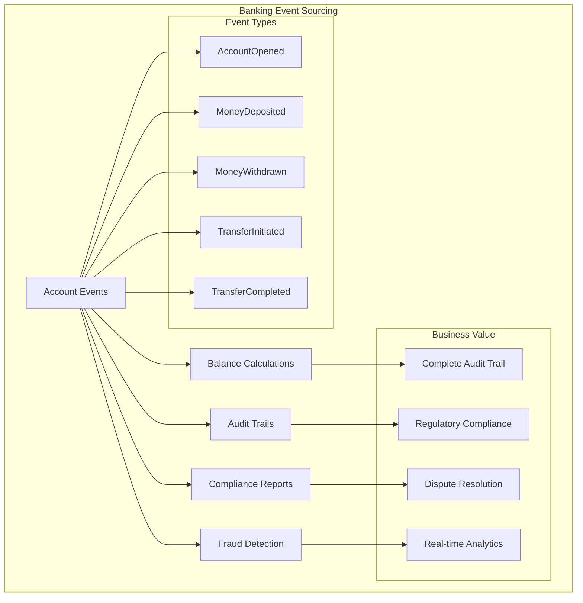

**Real-World Example: Digital Bank Transaction System**

```json
// Event stream for account transactions
[
  {
    "eventType": "AccountOpened",
    "accountId": "acc-123",
    "customerId": "cust-456",
    "initialBalance": 1000.00,
    "currency": "USD",
    "timestamp": "2025-01-01T10:00:00Z",
    "regulatoryFlags": ["KYC_VERIFIED", "AML_CLEARED"]
  },
  {
    "eventType": "TransferReceived",
    "accountId": "acc-123",
    "amount": 2500.00,
    "sourceAccount": "acc-789",
    "transferId": "txn-001",
    "timestamp": "2025-01-02T14:30:00Z",
    "metadata": {
      "fraudScore": 0.1,
      "complianceChecks": ["AML_PASSED", "SANCTIONS_CLEAR"]
    }
  },
  {
    "eventType": "SuspiciousActivityDetected",
    "accountId": "acc-123",
    "riskScore": 0.85,
    "triggers": ["UNUSUAL_AMOUNT", "VELOCITY_ANOMALY"],
    "timestamp": "2025-01-02T14:31:00Z",
    "action": "ACCOUNT_FLAGGED"
  }
]
```

**Key Success Metrics**:

- 100% transaction auditability
- Sub-second fraud detection
- Regulatory exam preparation time reduced by 80%
- Dispute resolution time reduced from days to hours

#### Trading and Investment Platforms

**Scenario**: High-frequency trading platform processing millions of trades daily.

**Event Sourcing Value Proposition**:

- **Trade Audit Trail**: Every order, execution, and modification tracked
- **Market Data Replay**: Reconstruct market conditions at any point in time
- **Regulatory Reporting**: Automated compliance report generation
- **Performance Analysis**: Historical strategy backtesting

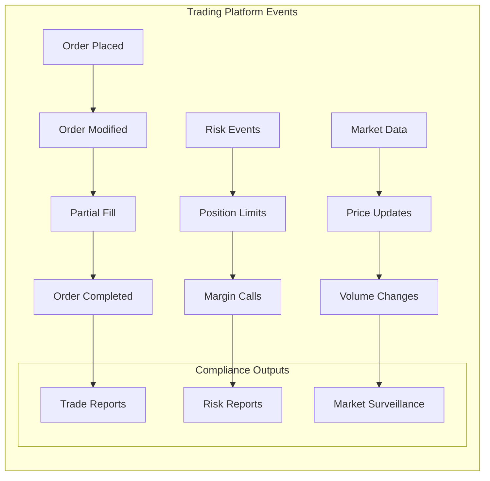

### E-Commerce and Retail

E-commerce platforms benefit from Event Sourcing's ability to track customer journeys, inventory changes, and order fulfillment processes with complete visibility.

#### Order Management System

**Business Challenge**: Complex order lifecycle with multiple stakeholders (customers, warehouses, shipping providers, payment processors).

**Event Sourcing Solution**:

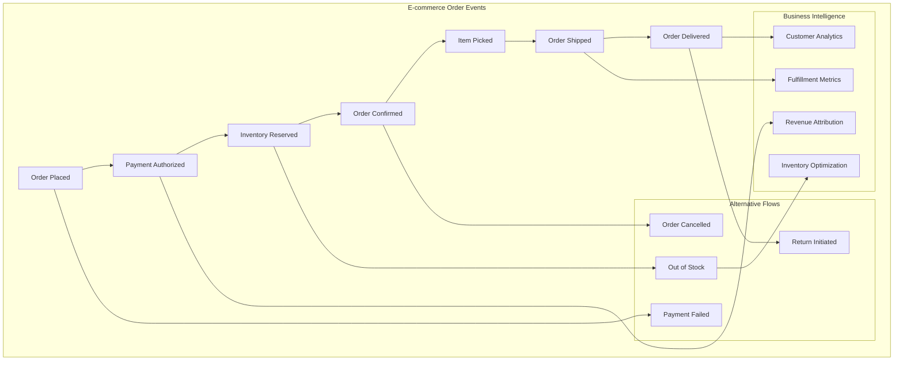

**Real-World Impact**: Leading e-commerce company reduced order investigation time from 2 hours to 5 minutes by implementing Event Sourcing for order tracking.

#### Inventory Management

**Use Case**: Multi-channel retail with complex inventory tracking across warehouses, stores, and online platforms.

**Event Sourcing Benefits**:

- **Inventory Accuracy**: Real-time stock levels across all channels
- **Demand Forecasting**: Historical sales patterns for predictive analytics
- **Audit Compliance**: Complete inventory movement tracking
- **Reconciliation**: Automated detection of inventory discrepancies

### Healthcare and Life Sciences

Healthcare systems require strict audit trails for patient safety, regulatory compliance, and research purposes.

#### Electronic Health Records (EHR)

**Regulatory Requirements**:

- HIPAA compliance for patient data protection
- FDA 21 CFR Part 11 for electronic records
- Complete audit trail for patient safety
- Data integrity for clinical research

**Event Sourcing Implementation**:

```json
// Patient care event stream
[
  {
    "eventType": "PatientAdmitted",
    "patientId": "patient-123",
    "admissionReason": "chest_pain",
    "timestamp": "2025-01-01T08:00:00Z",
    "providerId": "dr-smith",
    "facilityId": "hospital-main"
  },
  {
    "eventType": "VitalSignsRecorded",
    "patientId": "patient-123",
    "vitals": {
      "bloodPressure": "140/90",
      "heartRate": 85,
      "temperature": 98.6
    },
    "timestamp": "2025-01-01T08:15:00Z",
    "recordedBy": "nurse-johnson"
  },
  {
    "eventType": "MedicationAdministered",
    "patientId": "patient-123",
    "medication": "aspirin",
    "dosage": "81mg",
    "timestamp": "2025-01-01T09:00:00Z",
    "administeredBy": "nurse-johnson",
    "prescribedBy": "dr-smith"
  }
]
```

**Business Value**:

- **Patient Safety**: Complete medication and treatment history
- **Clinical Research**: Historical data for outcomes analysis
- **Regulatory Compliance**: Automated audit trail generation
- **Quality Improvement**: Process optimization through historical analysis

### Gaming and Entertainment

Gaming platforms leverage Event Sourcing for player progression tracking, game state management, and analytics.

#### Multiplayer Game State Management

**Technical Challenges**:

- Real-time game state synchronization
- Player action history
- Cheat detection and prevention
- Game analytics and balancing

**Event Sourcing Solution**:

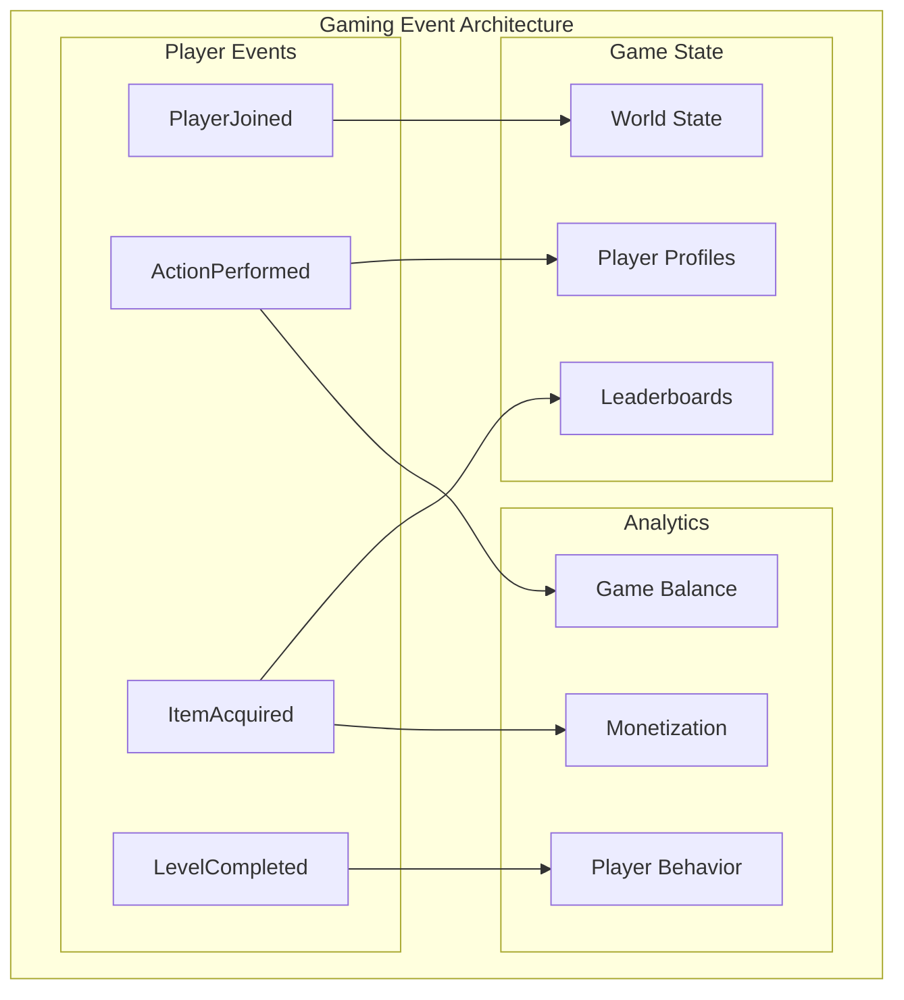

**Success Story**: Major gaming company reduced player support ticket resolution time by 75% using Event Sourcing to replay and analyze player sessions.

## Decision Matrix: When to Use Event Sourcing

### Comprehensive Evaluation Framework

| Criteria | Weight | Traditional CRUD | Event Sourcing | Recommendation |
|----------|--------|------------------|----------------|----------------|
| **Audit Requirements** | High | ⭐⭐ | ⭐⭐⭐⭐⭐ | Use ES for strict audit needs |
| **Temporal Analysis** | High | ⭐ | ⭐⭐⭐⭐⭐ | Use ES for historical analysis |
| **Complex Business Rules** | Medium | ⭐⭐⭐ | ⭐⭐⭐⭐ | ES better for complex domains |
| **Simple CRUD Operations** | Medium | ⭐⭐⭐⭐⭐ | ⭐⭐ | CRUD better for simplicity |
| **Team Experience** | High | ⭐⭐⭐⭐ | ⭐⭐ | Consider team capabilities |
| **Performance (Reads)** | Medium | ⭐⭐⭐⭐ | ⭐⭐⭐ | CRUD faster for simple reads |
| **Performance (Writes)** | Medium | ⭐⭐⭐ | ⭐⭐⭐⭐ | ES optimized for append-only |
| **Scalability** | High | ⭐⭐⭐ | ⭐⭐⭐⭐⭐ | ES excellent horizontal scaling |
| **Debugging Capability** | Medium | ⭐⭐ | ⭐⭐⭐⭐⭐ | ES superior for root cause analysis |
| **Storage Costs** | Medium | ⭐⭐⭐⭐ | ⭐⭐ | CRUD more storage efficient |

### Decision Tree

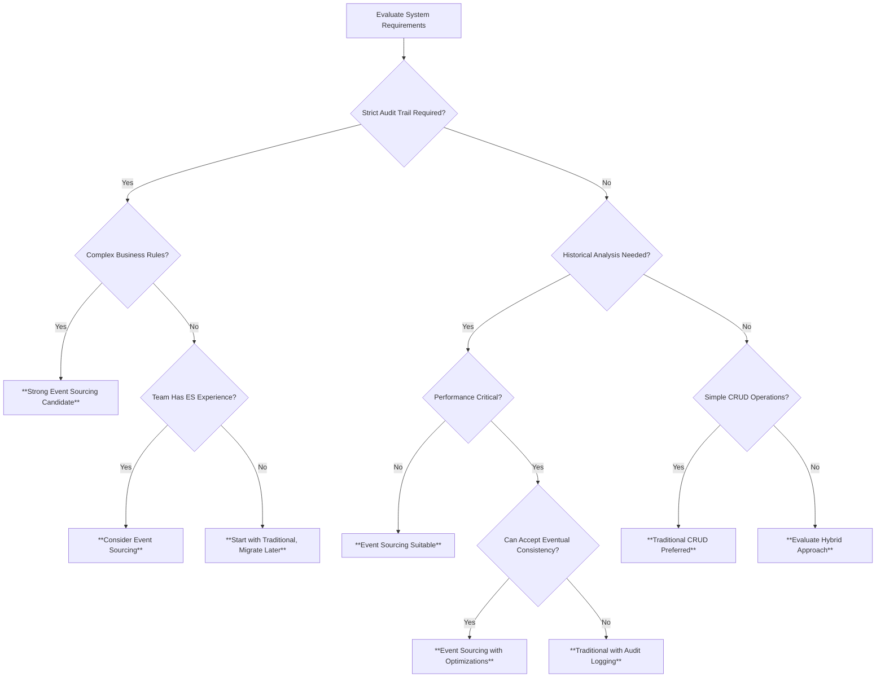

### Use vs. Avoid Guidelines

#### **Strongly Consider Event Sourcing When**:

- **Regulatory compliance** requires immutable audit trails
- **Complex business processes** with multiple state transitions
- **Temporal analysis** is a core business requirement
- **Integration with multiple systems** requires event notifications
- **Dispute resolution** needs complete historical context
- **Debugging complex workflows** is challenging with current state
- **Analytics and reporting** require historical data reconstruction

#### **Avoid Event Sourcing When**:

- **Simple CRUD applications** with minimal business logic
- **Immediate consistency** is absolutely critical
- **Team lacks experience** with event-driven architectures
- **Storage costs** are the primary constraint
- **Query patterns** are exclusively current-state focused
- **Rapid prototyping** with frequently changing requirements
- **Legacy system integration** is prohibitively complex

## Real-World Case Studies

### Case Study 1: Global Bank Trade Finance Platform

**Background**: International bank processing $2B+ in trade finance transactions annually.

**Challenge**: 
- Manual audit processes taking weeks
- Regulatory compliance failures
- Inability to trace transaction origins
- Complex multi-party trade workflows

**Event Sourcing Implementation**:

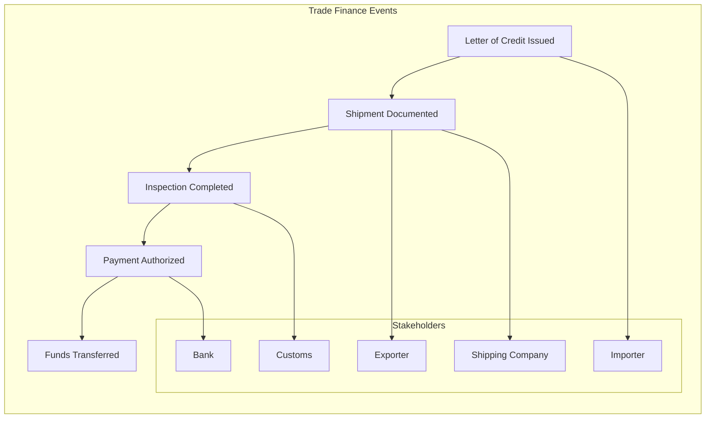

**Results**:
- **Audit time**: Reduced from 3 weeks to 2 hours
- **Compliance score**: Improved from 78% to 99.5%
- **Processing time**: 40% reduction in transaction completion
- **Dispute resolution**: 90% faster resolution time
- **ROI**: 350% within 18 months

**Key Success Factors**:
- Executive sponsorship for culture change
- Comprehensive team training program
- Phased rollout starting with pilot transactions
- Investment in monitoring and observability tools

### Case Study 2: E-commerce Marketplace Fraud Detection

**Background**: Online marketplace with 10M+ daily transactions.

**Challenge**:
- Increasing fraud losses ($50M+ annually)
- False positive rate affecting customer experience
- Inability to analyze fraud patterns historically
- Slow incident response times

**Event Sourcing Solution**:

**Architecture**:
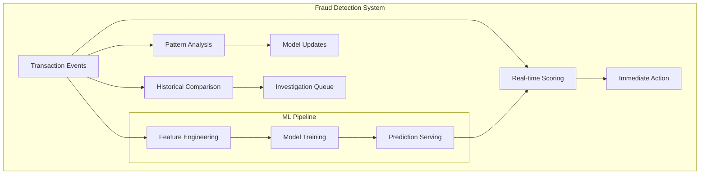

**Implementation Timeline**:
- **Month 1-2**: Event schema design and infrastructure setup
- **Month 3-4**: Real-time event processing implementation
- **Month 5-6**: ML pipeline integration and testing
- **Month 7-8**: Production rollout and monitoring

**Results**:
- **Fraud detection accuracy**: Improved from 75% to 94%
- **False positive rate**: Reduced from 12% to 3%
- **Investigation time**: Reduced from 4 hours to 15 minutes
- **Annual savings**: $35M in prevented fraud losses
- **Customer satisfaction**: 25% improvement in transaction experience

### Case Study 3: Healthcare Patient Care Coordination

**Background**: Regional healthcare network with 15 hospitals and 200+ clinics.

**Challenge**:
- Fragmented patient records across systems
- Medication errors due to incomplete history
- Regulatory compliance issues
- Poor care coordination

**Event Sourcing Implementation**:

**Patient Journey Events**:
```json
[
  {
    "eventType": "PatientRegistered",
    "patientId": "patient-789",
    "demographics": {...},
    "consentFlags": ["TREATMENT", "BILLING", "RESEARCH_OPT_OUT"]
  },
  {
    "eventType": "AppointmentScheduled",
    "patientId": "patient-789",
    "providerId": "cardiology-clinic",
    "appointmentType": "consultation",
    "scheduledDate": "2025-02-15T14:00:00Z"
  },
  {
    "eventType": "DiagnosisAdded",
    "patientId": "patient-789",
    "diagnosis": "hypertension",
    "icd10Code": "I10",
    "providerId": "dr-williams",
    "confidence": "confirmed"
  }
]
```

**Results**:
- **Medication errors**: Reduced by 85%
- **Care coordination**: 60% improvement in provider communication
- **Regulatory compliance**: Achieved 100% audit success rate
- **Patient satisfaction**: 30% improvement in care experience
- **Cost savings**: $12M annually through improved efficiency

## Anti-Patterns and Common Pitfalls

### Technical Anti-Patterns

#### 1. Event Store as Message Queue

**Anti-Pattern**: Using the event store for temporary messaging between services.


**Correct Approach**: Use dedicated message queues for temporary communication, event stores for permanent business events.

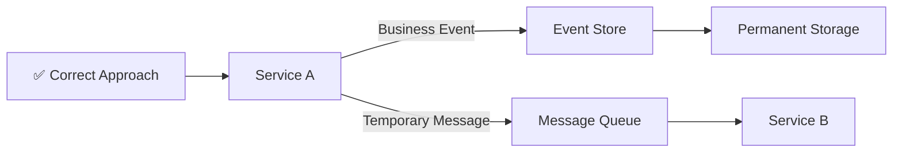

#### 2. Oversized Events

**Anti-Pattern**: Including entire object state in events instead of just changes.

```json
// ❌ Anti-pattern: Oversized event
{
  "eventType": "CustomerUpdated",
  "customerId": "cust-123",
  "customerData": {
    // Entire customer object with 50+ fields
    "firstName": "John",
    "lastName": "Doe",
    // ... 48 more fields that didn't change
  }
}
```

**Correct Approach**: Include only changed data and essential context.

```json
// ✅ Correct: Focused event
{
  "eventType": "CustomerEmailChanged",
  "customerId": "cust-123",
  "oldEmail": "john.old@example.com",
  "newEmail": "john.new@example.com",
  "changedBy": "user-456",
  "timestamp": "2025-01-15T10:30:00Z"
}
```

#### 3. Projection Coupling

**Anti-Pattern**: Tightly coupling projections to specific event structures.

**Impact**: Difficult schema evolution and maintenance.

**Solution**: Use event versioning and projection adapters.

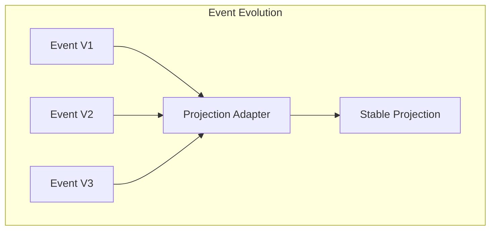

### Business Anti-Patterns

#### 1. Event Sourcing Everything

**Anti-Pattern**: Applying Event Sourcing to all parts of a system regardless of need.

**Problems**:
- Unnecessary complexity for simple operations
- Increased development and operational overhead
- Team cognitive load

**Solution**: Selective application based on business value and technical requirements.

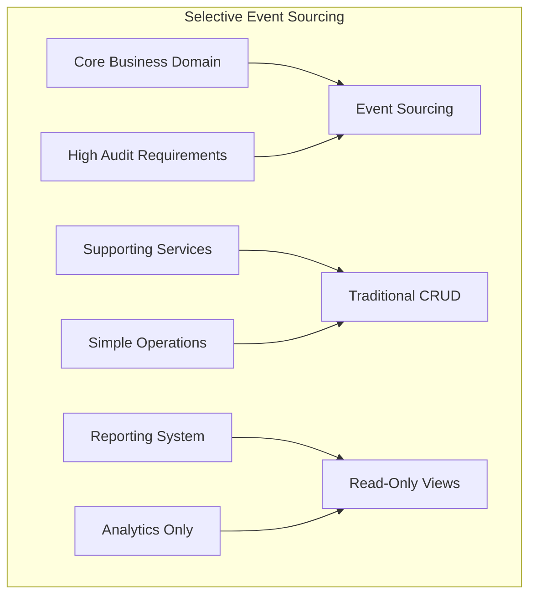

#### 2. Inadequate Event Modeling

**Anti-Pattern**: Technical events instead of business events.

```json
// ❌ Technical event
{
  "eventType": "DatabaseRowUpdated",
  "table": "customers",
  "rowId": 123,
  "changes": {"status": "active"}
}

// ✅ Business event
{
  "eventType": "CustomerActivated",
  "customerId": "cust-123",
  "activatedBy": "support-agent-456",
  "reason": "verification_completed"
}
```

### Operational Anti-Patterns

#### 1. Insufficient Monitoring

**Common Oversight**: Focusing only on functional requirements without operational observability.

**Essential Monitoring Metrics**:

| Metric Category | Key Metrics | Purpose |
|----------------|-------------|---------|
| **Event Store Health** | Write latency, storage growth, error rates | Operational reliability |
| **Projection Performance** | Processing lag, rebuild times, error rates | Read model health |
| **Business Metrics** | Event volume by type, processing success rates | Business insights |
| **Infrastructure** | CPU, memory, disk I/O, network | Resource optimization |

#### 2. Inadequate Error Handling

**Anti-Pattern**: Failing silently when event processing fails.

**Solution**: Comprehensive error handling strategy.

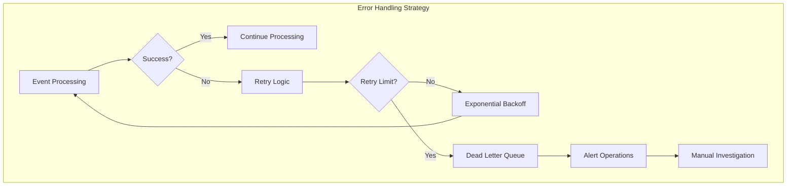

## Scenario-Based Comparisons

### Scenario 1: Customer Support System

**Business Context**: SaaS company with 100K+ customers needing comprehensive support ticket tracking.

#### Traditional CRUD Approach

```sql
-- Current state only
CREATE TABLE support_tickets (
    id UUID PRIMARY KEY,
    customer_id UUID,
    status VARCHAR(20),
    priority VARCHAR(10),
    assigned_to UUID,
    created_at TIMESTAMP,
    updated_at TIMESTAMP,
    description TEXT
);
```

**Limitations**:
- No history of status changes
- Cannot track who made changes when
- Difficult root cause analysis
- Limited analytics capabilities

#### Event Sourcing Approach

```json
// Complete ticket lifecycle
[
  {
    "eventType": "TicketCreated",
    "ticketId": "ticket-123",
    "customerId": "cust-456",
    "priority": "high",
    "category": "billing",
    "description": "Cannot access premium features",
    "createdBy": "customer-portal",
    "timestamp": "2025-01-15T09:00:00Z"
  },
  {
    "eventType": "TicketAssigned",
    "ticketId": "ticket-123",
    "assignedTo": "agent-789",
    "assignedBy": "system-auto-assignment",
    "timestamp": "2025-01-15T09:02:00Z"
  },
  {
    "eventType": "TicketStatusChanged",
    "ticketId": "ticket-123",
    "fromStatus": "open",
    "toStatus": "in_progress",
    "changedBy": "agent-789",
    "timestamp": "2025-01-15T10:15:00Z"
  },
  {
    "eventType": "CustomerResponseAdded",
    "ticketId": "ticket-123",
    "responseText": "I tried the suggested solution...",
    "addedBy": "cust-456",
    "timestamp": "2025-01-15T14:30:00Z"
  }
]
```

**Advantages**:
- Complete audit trail of all changes
- Customer interaction history
- Agent performance analytics
- Process optimization insights

#### Comparison Results

| Aspect | Traditional CRUD | Event Sourcing | Winner |
|--------|------------------|----------------|---------|
| **Implementation Speed** | 2 weeks | 6 weeks | CRUD |
| **Audit Capabilities** | Limited | Complete | ES |
| **Analytics Depth** | Basic | Rich | ES |
| **Debugging Support Issues** | Difficult | Excellent | ES |
| **Performance (Simple Queries)** | Fast | Moderate | CRUD |
| **Regulatory Compliance** | Manual effort | Automatic | ES |
| **Operational Complexity** | Low | Medium | CRUD |

**Recommendation**: Event Sourcing preferred for customer support systems due to audit requirements and analytics value.

### Scenario 2: Content Management System

**Business Context**: News website with moderate content creation and high read traffic.

#### Analysis

**Content Creation Pattern**:
- 50 articles/day
- 10 updates per article average
- 1M+ page views daily
- Simple content workflow (draft → review → published)

**Traditional CRUD Assessment**:
- **Pros**: Simple implementation, fast reads, well-understood patterns
- **Cons**: Limited change tracking, difficult content analytics

**Event Sourcing Assessment**:
- **Pros**: Complete content lifecycle tracking, author analytics, A/B testing support
- **Cons**: Implementation complexity, over-engineering for simple workflows

**Decision**: Traditional CRUD recommended due to simple business requirements and read-heavy workload.

### Scenario 3: IoT Sensor Data Platform

**Business Context**: Industrial IoT platform collecting sensor data from 10,000+ devices.

#### Data Characteristics

- **Volume**: 1M+ sensor readings per minute
- **Variety**: Temperature, pressure, vibration, flow rate sensors
- **Velocity**: Real-time alerting and dashboard updates
- **Retention**: 7-year regulatory requirement
- **Analytics**: Predictive maintenance, trend analysis

#### Event Sourcing Advantages

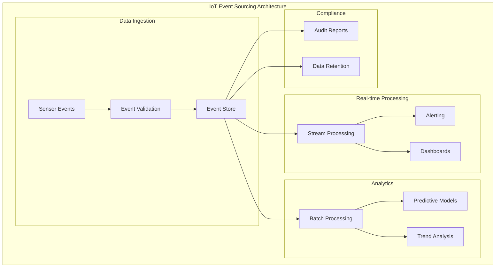

**Benefits**:
- **Immutable sensor history**: Perfect for regulatory compliance
- **Time-series analytics**: Natural fit for sensor data patterns
- **Scalable ingestion**: Append-only writes optimize for high-throughput
- **Flexible projections**: Multiple views for different use cases

**Recommendation**: Strong Event Sourcing candidate due to time-series nature, compliance requirements, and analytics needs.

## Scaling Considerations

### Performance Scaling Patterns

#### Write Scaling

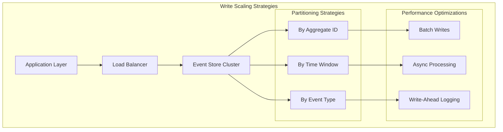

#### Read Scaling

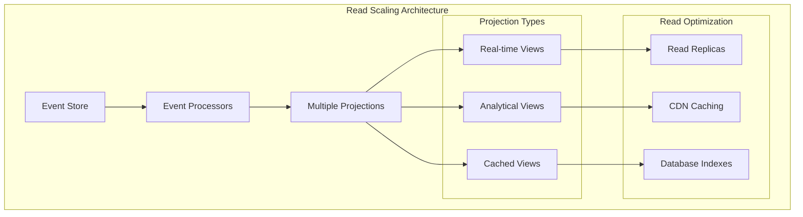

### Scaling Tiers and Recommendations

| Scale Tier | Event Volume | Architecture Pattern | Technology Recommendations |
|------------|--------------|---------------------|---------------------------|
| **Small** | <10K events/day | Single-node event store | PostgreSQL, Simple projections |
| **Medium** | 10K-1M events/day | Clustered event store | EventStore DB, Apache Kafka |
| **Large** | 1M-100M events/day | Distributed architecture | Apache Kafka, Cassandra/DynamoDB |
| **Enterprise** | >100M events/day | Multi-region deployment | Custom event stores, Apache Pulsar |

### Cost-Performance Trade-offs

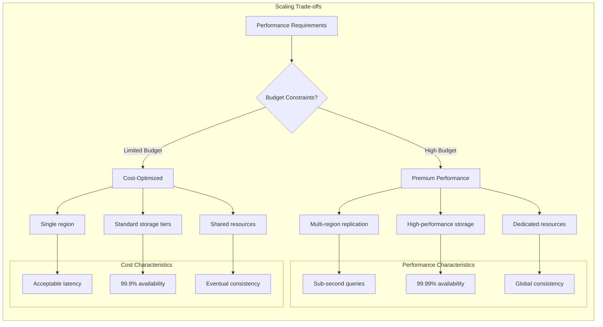

## Cost-Benefit Analysis Framework

### Total Cost of Ownership (TCO) Model

#### Development Costs

| Cost Category | Traditional CRUD | Event Sourcing | Multiplier |
|---------------|------------------|----------------|------------|
| **Initial Development** | 100% | 150-200% | 1.5-2.0x |
| **Testing Complexity** | 100% | 130-150% | 1.3-1.5x |
| **Team Training** | 100% | 200-300% | 2.0-3.0x |
| **Documentation** | 100% | 150% | 1.5x |

#### Operational Costs

| Cost Category | Traditional CRUD | Event Sourcing | Multiplier |
|---------------|------------------|----------------|------------|
| **Infrastructure** | 100% | 120-150% | 1.2-1.5x |
| **Monitoring** | 100% | 130% | 1.3x |
| **Maintenance** | 100% | 110% | 1.1x |
| **Support** | 100% | 80% | 0.8x |

#### Business Value Benefits

| Benefit Category | Quantifiable Value | Time to Realize |
|------------------|-------------------|-----------------|
| **Audit Compliance** | $50K-500K annually | 3-6 months |
| **Debugging Efficiency** | 50-80% time reduction | 1-3 months |
| **Analytics Capabilities** | 10-30% revenue increase | 6-12 months |
| **Regulatory Readiness** | $100K-1M in avoided fines | 6-18 months |
| **Customer Support** | 30-50% resolution time reduction | 3-6 months |

### ROI Calculation Framework

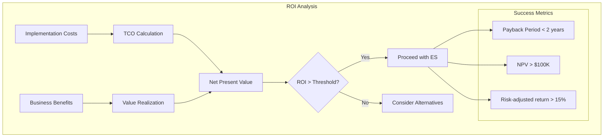

### Business Value Propositions

#### For Technical Stakeholders

**Value Propositions**:

1. **Improved System Reliability**
   - Complete audit trail for troubleshooting
   - Time-travel debugging capabilities
   - Immutable data prevents corruption

2. **Enhanced Scalability**
   - Append-only writes optimize performance
   - Independent read/write scaling
   - Natural partitioning strategies

3. **Reduced Technical Debt**
   - Clear separation of concerns
   - Flexible schema evolution
   - Testable business logic

#### For Business Stakeholders

**Value Propositions**:

1. **Risk Mitigation**
   - Regulatory compliance automation
   - Complete audit trails
   - Data integrity guarantees

2. **Business Intelligence**
   - Rich historical analytics
   - Customer behavior insights
   - Process optimization opportunities

3. **Competitive Advantage**
   - Faster feature development
   - Superior customer support
   - Data-driven decision making

#### For Executive Leadership

**Strategic Value Propositions**:

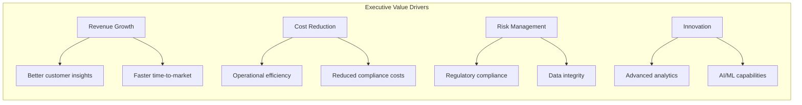

**Quantified Benefits**:

- **Revenue Impact**: 5-15% increase through better customer insights
- **Cost Savings**: 20-40% reduction in audit and compliance costs
- **Risk Reduction**: 80-90% reduction in regulatory examination issues
- **Innovation Velocity**: 30-50% faster analytics feature development

## Migration Strategies from Legacy Systems

### Migration Approach Matrix

| Current System Type | Recommended Strategy | Timeline | Risk Level |
|-------------------|---------------------|----------|------------|
| **Monolithic CRUD** | Strangler Fig Pattern | 12-24 months | Medium |
| **Microservices** | Service-by-Service | 6-18 months | Low |
| **Legacy Mainframe** | Event Gateway | 18-36 months | High |
| **Document Database** | Dual Write | 6-12 months | Medium |

### Strangler Fig Migration Pattern

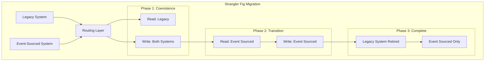

#### Phase-by-Phase Implementation

**Phase 1: Foundation (Months 1-3)**
- Set up event store infrastructure
- Implement basic event schemas
- Create initial projections
- Parallel testing environment

**Phase 2: Gradual Migration (Months 4-8)**
- Implement dual-write pattern
- Migrate non-critical features first
- Build confidence with low-risk areas
- Continuous validation and testing

**Phase 3: Core Migration (Months 9-12)**
- Migrate critical business features
- Switch read operations to projections
- Maintain legacy system as backup
- Comprehensive monitoring

**Phase 4: Optimization (Months 13-18)**
- Remove legacy system dependencies
- Optimize event schemas
- Advanced projection features
- Performance tuning

### Change Data Capture (CDC) Strategy

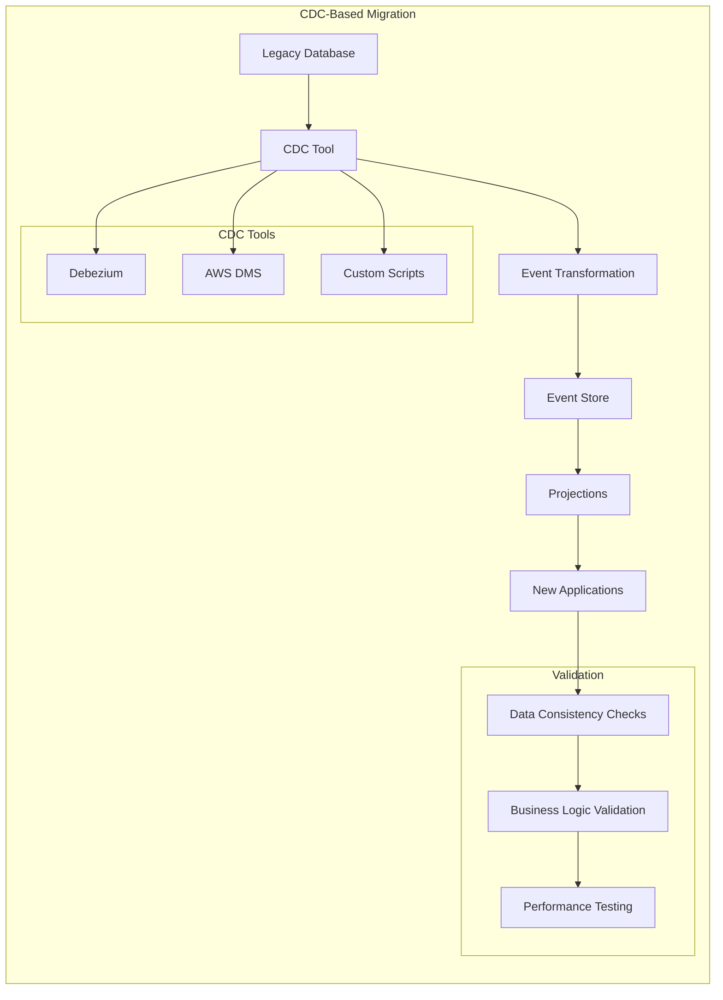

**Benefits**:
- Minimal disruption to existing systems
- Real-time data synchronization
- Gradual confidence building

**Challenges**:
- CDC tool configuration complexity
- Event schema design decisions
- Data consistency validation

### Dual Write Migration Pattern

```mermaid
graph TB
    subgraph "Dual Write Pattern"
        A[Application] --> B{Write Operation}
        B --> C[Legacy Database]
        B --> D[Event Store]
        
        C --> E[Legacy Projections]
        D --> F[Event Projections]
        
        G[Validation Service] --> H[Compare Results]
        E --> H
        F --> H
        
        H --> I{Results Match?}
        I -->|Yes| J[Continue]
        I -->|No| K[Alert & Investigate]
    end
```

**Implementation Considerations**:

1. **Transaction Handling**
   - Implement compensating transactions
   - Handle partial failures gracefully
   - Monitor consistency drift

2. **Performance Impact**
   - Expect 10-20% write latency increase
   - Implement async event writing where possible
   - Monitor system resources carefully

3. **Validation Strategy**
   - Automated consistency checking
   - Business logic validation
   - Performance regression testing

### Risk Mitigation Strategies

#### Technical Risks

| Risk | Probability | Impact | Mitigation Strategy |
|------|-------------|--------|-------------------|
| **Data Loss** | Low | High | Comprehensive backup and rollback procedures |
| **Performance Degradation** | Medium | Medium | Gradual rollout with performance monitoring |
| **Integration Failures** | High | Medium | Extensive integration testing and fallback plans |
| **Team Knowledge Gap** | High | High | Comprehensive training and external consulting |

#### Business Risks

| Risk | Probability | Impact | Mitigation Strategy |
|------|-------------|--------|-------------------|
| **Project Delays** | Medium | High | Phased approach with clear milestones |
| **Budget Overruns** | Medium | High | Regular budget reviews and scope management |
| **Business Disruption** | Low | High | Blue-green deployment strategies |
| **Stakeholder Resistance** | Medium | Medium | Clear communication and quick wins |

### Success Metrics and KPIs

#### Technical Metrics

```mermaid
graph TB
    subgraph "Migration Success Metrics"
        subgraph "Performance"
            A[Write Latency < 100ms]
            B[Read Latency < 50ms]
            C[99.9% Availability]
        end
        
        subgraph "Quality"
            D[Data Consistency 99.99%]
            E[Zero Data Loss]
            F[Bug Rate < 0.1%]
        end
        
        subgraph "Operations"
            G[Deployment Frequency]
            H[Recovery Time < 1hr]
            I[Team Productivity +20%]
        end
    end
```

#### Business Metrics

- **Audit Preparation Time**: Target 80% reduction
- **Compliance Score**: Target >95% automated compliance
- **Customer Support Resolution**: Target 50% faster resolution
- **Feature Development Velocity**: Target 30% improvement
- **Operational Cost**: Target neutral or 10% reduction

## Conclusion

Event Sourcing represents a powerful architectural pattern that excels in domains requiring comprehensive audit trails, complex business processes, and temporal analysis capabilities. However, its adoption requires careful evaluation of business requirements, team capabilities, and long-term strategic goals.

### Key Decision Factors

**Choose Event Sourcing when**:
- Audit trails and compliance are critical
- Business processes involve complex state transitions
- Historical analysis drives business value
- System integration requires event notifications
- Debugging and troubleshooting are challenging with current state

**Avoid Event Sourcing when**:
- Business requirements are simple and well-understood
- Team lacks experience with event-driven architectures
- Immediate consistency is absolutely required
- Storage costs are the primary constraint
- Rapid prototyping with changing requirements

### Implementation Success Factors

1. **Executive Sponsorship**: Ensure leadership support for the cultural and technical transition
2. **Team Preparation**: Invest in comprehensive training and knowledge transfer
3. **Phased Approach**: Start with pilot projects to build confidence and expertise
4. **Monitoring Investment**: Implement comprehensive observability from day one
5. **Business Alignment**: Maintain clear connection between technical implementation and business value

### Long-term Considerations

Event Sourcing is not just a technical decision—it's an architectural philosophy that affects how teams think about data, state, and system design. Organizations that successfully adopt Event Sourcing often find it becomes a competitive advantage, enabling rapid innovation, superior customer support, and robust compliance capabilities.

The key to success lies in careful evaluation of the decision frameworks provided in this document, honest assessment of organizational readiness, and commitment to the long-term journey of building event-driven systems.

## See Also

### Foundational Knowledge

- **[Event Sourcing Fundamentals](01-event-sourcing-fundamentals.md)** - Core concepts and principles
- **[Architectural Patterns](02-architectural-patterns.md)** - System design patterns and trade-offs
- **[Origins and Theoretical Foundations](05-origins-theoretical-foundations.md)** - Historical context and theoretical background

### Implementation Guidance

- **[Implementation Examples](03-implementation-examples.md)** - Practical code patterns for these use cases
- **[Event Design Patterns](03-implementation-examples.md#event-design-patterns-and-schemas)** - Event structure for specific domains
- **[Projection Patterns](03-implementation-examples.md#projection-building-examples)** - Read model implementations

### Architecture and Design

- [Integration Patterns](02-architectural-patterns.md#integration-patterns-with-existing-systems) - Legacy system integration
- [Scalability Patterns](02-architectural-patterns.md#scalability-patterns) - Performance and scaling considerations
- [Security Considerations](02-architectural-patterns.md#security-and-compliance-considerations) - Compliance and security patterns

### Decision Making

- [When to Use Event Sourcing](01-event-sourcing-fundamentals.md#when-to-use-event-sourcing) - Basic decision criteria
- [Architectural Trade-offs](02-architectural-patterns.md#architectural-trade-offs-and-decisions) - Technical considerations
- [Martin Fowler's Pattern Evolution](05-origins-theoretical-foundations.md#martin-fowlers-contributions-and-pattern-evolution) - Historical perspective on pattern adoption

## References

Based on comprehensive analysis of:

- [Event Sourcing Fundamentals](01-event-sourcing-fundamentals.md)
- [Architectural Patterns](02-architectural-patterns.md)
- [Implementation Examples](03-implementation-examples.md)
- [Kurrent.io Event Sourcing Guide](references/web_resources_cache/kurrent_io_event_sourcing.md)
- Industry case studies and practical implementations
- Martin Fowler's Event Sourcing patterns and best practices
- Real-world migration experiences and lessons learned

---

*This document provides practical guidance for evaluating and implementing Event Sourcing in real-world scenarios. Use the decision frameworks and case studies as starting points for your specific context and requirements. For implementation guidance, see [Implementation Examples](03-implementation-examples.md).*